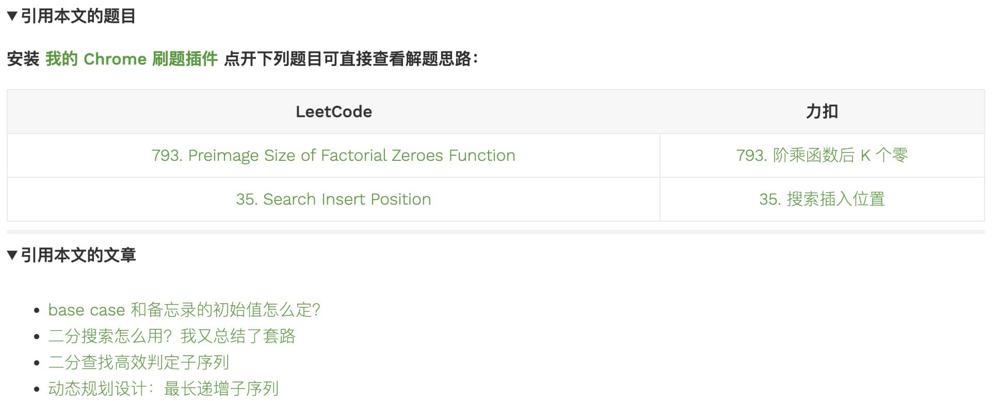

labuladong 的算法网站
======
> https://labuladong.github.io/algo/
> 
> 金字塔结构：结论先行、以上统下

结论先行：
如何解决技巧储备不足的问题呢？这就是我想解决的问题，
我把所有常用的算法技巧都集合起来，给你整理出一份「算法小抄」，就可以帮你在做题的过程中有一个方向性的指导。

论据：
学习算法可能遇到的问题
1、题太多，不知道从哪里开始刷。
2、没有人指导，刷一道题就仅仅是刷了一道题而已，很难举一反三。
3、被有意无意地灌输错误的思想，以为算法很高大上，非要啃完算法导论才算是入门，所以从心理上就畏惧算法。

都说算法难，到底难在哪里
1、技巧较多，难以整活儿
2、对于递归的理解不透彻

你能在这里学到什么

------

**1、由于 labuladong 的算法网站频繁遭到恶意攻击，所以本站同时开放多个镜像站点：**
* https://labuladong.github.io/algo/ （推荐）
* https://labuladong.gitee.io/algo/  （访问量太大，有点卡顿了）

这两个站点的内容都是一样的，你可以自行选择访问速度较快的站点开始学习。
PC 端请收藏上述网站地址，手机端请关注 labuladong 公众号阅读最新文章，
另外《labuladong 的算法小抄》纸质书已出版，关注公众号可获取最新折扣信息：

**2、配合我的 Chrome 刷题插件在本站学习的体验会更好**，刷题插件和配套 PDF 的下载方法见这里： [刷题三件套](https://mp.weixin.qq.com/s/X-fE9sR4BLi6T9pn7xP4pg) 。

本网站目前可以手把手带你解决 200 道算法问题，而且在不断更新，全部都是基于力扣的题目，涵盖了所有题型和技巧，
我已经在每篇文章的开头加上了该文章可以解决的题目链接，可以看完文章立即去拿下对应题目。
我还把本站讲解的所有题目整理成了题目列表，建议安装 Chrome 刷题插件后访问：
* 力扣版： https://leetcode-cn.com/problem-list/59jEaTgw/
* LeetCode 版： https://leetcode.com/list/9zwo3ww5

**3、我开发了很多贴心实用的小功能辅助大家学习算法。**

比如，有些较为复杂的代码块中包含小灯泡图标，鼠标移至小灯泡图标上就会弹出图片辅助理解，
比如 [递归魔法：反转单链表](https://labuladong.github.io/algo/2/17/17/) 中这段短小精悍的代码：

```java
// 定义：输入一个单链表头结点，将该链表反转，返回新的头结点
ListNode reverse(ListNode head) {
    if (head == null || head.next == null) {
        return head;
    }
    ListNode last = reverse(head.next);
    head.next.next = head;
    head.next = null;
    return last;
}
```

再比如，我在每篇文章末尾添加了该文章相关的其他文章及其他算法题：



刷题三件套 中的 PDF、Chrome 插件、vscode 插件与本站同步，全都拥有上述实用功能。

还有一个贴心小功能，侧边栏中学完的文章会显示 ✅ 标记，未学完文章会显示 🕒 标记，全部学完的章节会显示 🚩 标记。
如果有一天你把本站的所有文章刷完，那么侧边栏将会是一列小红旗 🚩，满满的成就感有没有~

**4、本站开放评论区，欢迎大家友好讨论。**
点赞是一种态度，如果有的评论帮助到了你，请不要吝惜你的点赞。
如果你想评论，请注意遵守本站的 评论礼仪，共同维护良好的学习氛围。


# 1.关于我
我应该是 2018 年就开始写算法题解，顺便开通了自己的公众号，诞生了 labuladong 这个昵称，
之后就一直在算法领域持续输出，2020 年在 GitHub 开源了算法仓库 fucking-algorithm，
没想到火遍了全网，现在这个仓库已经有 100k star 了。

由于这个仓库的火爆，有很多出版社找来寻求出版，
我在去年年底出版了纸质书《labuladong 的算法小抄》，销量一直非常稳定，
为了感谢公众号读者一直以来的支持，我把公众号的大部分文章放到了网站上，方便大家学习。

我想说的是，其实**刷题也好，面试也好，都是有技巧的**，我希望把我的技巧和经验分享给大家。
如果你有刷算法题的需求觉得算法难，面试笔试难，那么我可以提供一些捷径，避免你走太多弯路。

另外，**我奉行的原则是「少即是多」，致力于提高「知识密度」而不是文章数量。**

而我会严格限制文章数量的增长，把精力放在提高单篇文章质量上面，我称之为「**知识密度**」。
随着我自己不断刷题和思考，如果觉得某篇历史文章的知识密度不够高，
那么我会毫不犹豫地下架历史文章，重新构思和发布一篇更干、更通用的新文章。


# 2.学习算法可能遇到的问题
### 1、题太多，不知道从哪里开始刷。
现在 LeetCode 已经 2000 多道题目，难道我要全部刷完，才算搞定算法吗？

我应该怎么刷题？按题号一道道刷？按分类刷？听说动态规划相关的问题经常出现，干脆直接开始刷动态规划问题？

我理解大家这种急切的心情，但是在刷最热门的类型之前，有一些必要的前置知识，如果你不掌握的话，很可能一脸懵逼；
但如果按照一定的章法掌握之后，就能找到抓手，成功赋能，轻易地打出一套算法组合拳（手动滑稽）。

### 2、没有人指导，刷一道题就仅仅是刷了一道题而已，很难举一反三。
这是很多朋友都存在的问题，尤其是在刚开始刷题的时候，很难在做完一道题后总结出一些通用的技巧，
在遇到新的问题时运用出来，所以很多读者调侃自己「一看都会，一做就废」。

不需要气馁，在刚刚刷题的过程中，积累的算法技巧有限，难以举一反三很正常。
但**如果有人能够给一些思路上的引导，会让你学习算法的效率事半功倍。**

### 3、被有意无意地灌输错误的思想，以为算法很高大上，非要啃完算法导论才算是入门，所以从心理上就畏惧算法。
我对这个问题有切身体会，刚学算法那会儿，我会去搜索各种资料、经验贴之类的，想快速入门。

现在回头在看，就觉得很有意思，我是说很多写经验贴的作者心态很有意思。

举个例子，很多「大佬」，你问他怎么入门算法，他告诉你看《算法导论》，
然后又甩给你一堆英文课程，还强调一定要看英文的哦，中文的翻译不好。

这就好比，你是一个胖子，去问人家怎么减肥，人家告诉你，
每次做 100 个俯卧撑，100 个引体向上，一天三次，肯定有效，你看我就是这样练出来的！

呵呵，我要是真能做到这些，还用得着来问你么？
不过你仔细琢磨琢磨，给出这种回答是基于一种什么心理？

**实际上他根本不在乎你的诉求，他只是想告诉你：我做过这些，我吃过这些苦，我牛逼吧，我厉害吧，你羡慕吧，你做不到吧~**

不过话说回来，这种小九九人皆有之，我也不例外，我也时不时想证明自己牛，
想证明自己和别人不一样，我以前做分享，也会多少有点故弄玄虚的倾向。

但后来我发现，**真正帮助别人解决问题，是更能得到对方的认可的，这也是我的公众号能够很快成长的原因。**

所以大家可以放心，我的这份教程是「老少皆宜」，非常接地气的，最能解决学习算法这个问题的。


# 3.都说算法难，到底难在哪里
### 1、技巧较多，难以整活儿
各种算法技巧确实比较繁杂，初学者很容易碰到没见过的技巧，碰到时就大呼牛逼，觉得自己菜。
比如说判断一个单链表是否成环的算法，一般人确实很难想到。

这也是为什么我说一开始刷算法题不要死磕，因为技巧储备还不够。

比如现在出一道数组的题目，你的脑海里能浮现出什么算法技巧？
最起码应该想到 二分查找、 快慢指针、 左右指针、 滑动窗口、 前缀和数组、 差分数组。

这些技巧就好比工具库里各种型号的工具，你得有的选，才能运用出来不是吗？
那么对于初学者，工具库里面就没什么东西，拿什么死磕？用锯子去挖石头，这不扯淡吗？

那么**如何解决技巧储备不足的问题呢？这就是我想解决的问题，
我把所有常用的算法技巧都集合起来，给你整理出一份「算法小抄」，就可以帮你在做题的过程中有一个方向性的指导。**

下次遇到数组相关的题目时，你把我总结的数组相关的技巧都拿出来，**一个个试，形成一套固定的做题方法，**
那遇到新的算法题，不就来者不惧了吗？

### 2、对于递归的理解不透彻
**递归思维是经典的计算机思维**，如果掌握不好，很多时候你去看别人的题解代码可能都看不懂，这就很打击人的自信，觉得自己好菜。

不用气馁，递归确实不好理解，因为它是「计算机思维」嘛，你是个人，又不是个计算机，当然不容易理解了。

**要掌握递归，关键要跳出细节，培养框架思维，尝试从整体上理解算法的过程。**

**以我的刷题经验，初学者最好从「树」相关的问题开始刷题，
为此我特意写了 [手把手刷二叉树（纲领篇）](https://labuladong.github.io/algo/2/19/33/) ，帮你从二叉树的视角理解各种复杂的算法。**

另外， 我的刷题插件 中也集成了 [手把手刷题二叉树题目](https://mp.weixin.qq.com/s/OE1zPVPj0V2o82N4HtLQbw) 的功能，
帮助大家**培养框架思维。**

别不信，到后面你会发现**递归代码反而是最简单，最容易理解的。**


# 4.你能在这里学到什么
我的读者可以大致分两类：一类对算法完全没有兴趣，属于面向笔试学习算法的读者；
另一类是对算法感兴趣，能够享受纯粹求知乐趣的读者。

我个人属于后者，自然希望后者多一些，但毕竟人各有志，两种读者没有对错之分。
而且人总是会变的，说不定学着学着就改变想法了呢？这也未可知。

我的文章能够同时满足这两者的需求：

首先，我会**结合自己的刷题经验，有所取舍，忽略性价比不高的算法技巧，
抽象出常用算法的框架，帮助大家高效掌握算法，搞定面试笔试。**

另外，我也会**清晰地描述自己的解题过程，阐述算法的底层原理，帮助大家培养框架思维以及举一反三的能力，**
力求让大家真正爱上算法，每天不刷两道题都难受的那种，已经有不少读者在评论区说刷题跟打游戏似的，上起瘾了。

所以，不管你是刚刚入门算法的小白，还是已经对算法有所小成，希望进阶，我相信这些内容都会对你有帮助。

另外，经常有读者问，**我的教程应该按照什么顺序学习。**

**最好的情况当然是按照我编排的顺序阅读所有文章**，
已经有几十个读者私下跟我说靠我的公众号零基础入门算法， 最后进到了谷歌，
**他们都是把我的历史文章看完了，有的部分还看了好几遍。**
当然，对于基础已经比较好的读者，可以选自己感兴趣的模块针对性学习。

我只强调一点：

**基本数据结构相关的算法，主要是数组、链表相关的算法，** 比如 双指针算法， 滑动窗口算法 等，
**不需要什么前置知识，技巧虽然精妙，但你理解起来也不会很困难。**

但稍微进阶一些的算法技巧，主要是递归相关的算法，比如 回溯算法， 动态规划，
或者高级数据结构相关算法 Dijkstra 算法， 字典树算法 等，**你不要上来就学它们，否则很容易劝退。
这些递归算法需要二叉树算法作为铺垫，你应该先学习我的二叉树专题文章，再去学习这些高级算法，就能融会贯通了。**

最后，公众号后台回复「进群」可加入算法群，**大家一起刷题，从现在开始，养成刷题的好习惯：**

