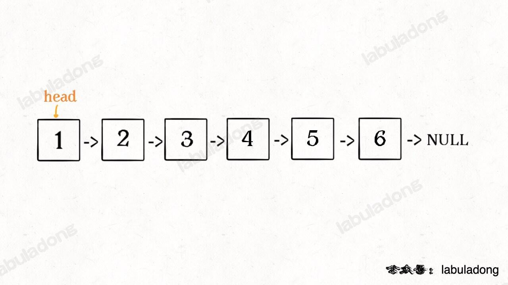
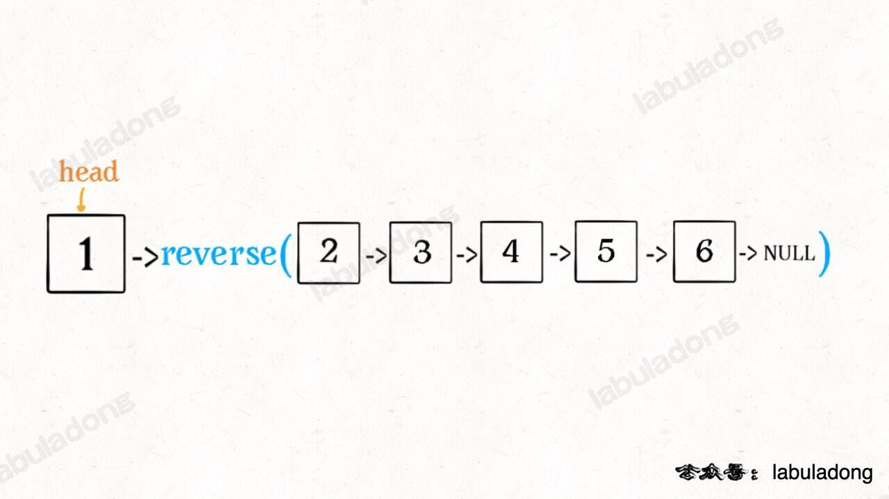

递归魔法：反转单链表
======
> https://labuladong.github.io/algo/2/17/17/


读完本文，你不仅学会了**算法套路**，还可以顺便解决如下题目：

[92. 反转链表 II](https://leetcode.cn/problems/reverse-linked-list-ii/)

[206. 反转链表](https://leetcode.cn/problems/reverse-linked-list/)

**-----------**

**反转单链表的迭代实现**不是一个困难的事情，但是**递归实现**就有点难度了，
如果再加一点难度，让你**仅仅反转单链表中的一部分，你是否能够递归实现呢？**

本文就来由浅入深，step by step 地解决这个问题。
如果你还不会递归地反转单链表也没关系，**本文会从递归反转整个单链表开始拓展**，
只要你明白单链表的结构，相信你能够有所收获。

```java
// 单链表节点的结构
public class ListNode {
    int val;
    ListNode next;
    ListNode(int x) { val = x; }
}
```

什么叫反转单链表的一部分呢，就是给你一个索引区间，让你把单链表中这部分元素反转，其他部分不变。

看下力扣第 92 题「反转链表 II」：


**注意这里的索引是从 1 开始的**。迭代的思路大概是：
先用一个 for 循环找到第 `m` 个位置，然后再用一个 for 循环将 `m` 和 `n` 之间的元素反转。
但是我们的递归解法不用一个 for 循环，纯递归实现反转。

迭代实现思路看起来虽然简单，但是细节问题很多的，反而不容易写对。
相反，递归实现就很简洁优美，下面就由浅入深，先从反转整个单链表说起。


# 一、递归反转整个链表

这也是力扣第 206 题「反转链表」，递归反转单链表的算法可能很多读者都听说过，
这里详细介绍一下，直接看代码实现：

```java
// 定义：输入一个单链表头结点，将该链表反转，返回新的头结点
ListNode reverse(ListNode head) {
    if (head == null || head.next == null) {
        return head;
    }
    ListNode last = reverse(head.next);
    head.next.next = head;
    head.next = null;
    return last;
}
```

看起来是不是感觉不知所云，完全不能理解这样为什么能够反转链表？
这就对了，这个算法常常拿来显示**递归的巧妙和优美**，我们下面来详细解释一下这段代码。

**对于递归算法，最重要的就是明确递归函数的定义**。
具体来说，我们的 `reverse` 函数定义是这样的：

**输入一个节点 `head`，将「以 `head` 为起点」的链表反转，并返回反转之后的头结点**。

明白了函数的定义，再来看这个问题。
比如说我们想反转这个链表：



那么输入 `reverse(head)` 后，会在这里进行递归：

```
ListNode last = reverse(head.next);
```

不要跳进递归（你的脑袋能压几个栈呀？），
而是要根据刚才的函数定义，来弄清楚这段代码会产生什么结果：



这个 `reverse(head.next)` 执行完成后，整个链表就成了这样：


并且根据函数定义，`reverse` 函数会返回反转之后的头结点，我们用变量 `last` 接收了。

现在再来看下面的代码：

```java
head.next.next = head;
```


接下来：

```java
head.next = null;
return last;
```


神不神奇，这样整个链表就反转过来了！
递归代码就是这么简洁优雅，不过其中有两个地方需要注意：

**1、递归函数要有 base case**，也就是这句：

```java
if (head == null || head.next == null) {
    return head;
}
```

意思是如果链表为空或者只有一个节点的时候，反转结果就是它自己，直接返回即可。

**2、当链表递归反转之后，新的头结点是 `last`，而之前的 `head` 变成了最后一个节点，
别忘了链表的末尾要指向 null**：

```java
head.next = null;
```

理解了这两点后，我们就可以进一步深入了，接下来的问题其实都是在这个算法上的扩展。


# 二、反转链表前 N 个节点

这次我们实现一个这样的函数：

```java
// 将链表的前 n 个节点反转（n <= 链表长度）
ListNode reverseN(ListNode head, int n)
```

比如说对于下图链表，执行 `reverseN(head, 3)`：


解决思路和反转整个链表差不多，只要稍加修改即可：

```java
ListNode successor = null; // 后驱节点

// 反转以 head 为起点的 n 个节点，返回新的头结点
ListNode reverseN(ListNode head, int n) {
    if (n == 1) {
        // 记录第 n + 1 个节点
        successor = head.next;
        return head;
    }
    // 以 head.next 为起点，需要反转前 n - 1 个节点
    ListNode last = reverseN(head.next, n - 1);

    head.next.next = head;
    // 让反转之后的 head 节点和后面的节点连起来
    head.next = successor;
    return last;
}
```

具体的区别：

1、base case 变为 `n == 1`，反转一个元素，就是它本身，同时要记录后驱节点。

2、刚才我们直接把 `head.next` 设置为 null，
因为整个链表反转后原来的 `head` 变成了整个链表的最后一个节点。
但现在 `head` 节点在递归反转之后不一定是最后一个节点了，
所以要记录后驱 `successor`（第 `n + 1` 个节点），反转之后将 `head` 连接上。


OK，如果这个函数你也能看懂，就离实现「反转一部分链表」不远了。


# 三、反转链表的一部分

现在解决我们最开始提出的问题，
给一个索引区间 `[m, n]`（索引从 1 开始），仅仅反转区间中的链表元素。

```java
ListNode reverseBetween(ListNode head, int m, int n)
```

首先，如果 `m == 1`，就相当于反转链表开头的 `n` 个元素嘛，
也就是我们刚才实现的功能：

```java
ListNode reverseBetween(ListNode head, int m, int n) {
    // base case
    if (m == 1) {
        // 相当于反转前 n 个元素
        return reverseN(head, n);
    }
    // ...
}
```

如果 `m != 1` 怎么办？
如果我们把 `head` 的索引视为 1，那么我们是想从第 `m` 个元素开始反转对吧；
如果把 `head.next` 的索引视为 1 呢？
那么相对于 `head.next`，反转的区间应该是从第 `m - 1` 个元素开始的；
那么对于 `head.next.next` 呢……

区别于迭代思想，这就是**递归思想**，所以我们可以完成代码：

```java
ListNode reverseBetween(ListNode head, int m, int n) {
    // base case
    if (m == 1) {
        return reverseN(head, n);
    }
    // 前进到反转的起点触发 base case
    head.next = reverseBetween(head.next, m - 1, n - 1);
    return head;
}
```

至此，我们的最终大 BOSS 就被解决了。


# 四、最后总结

**递归的思想**相对迭代思想，稍微有点难以理解，
处理的技巧是：不要跳进递归，而是**利用明确的定义来实现算法逻辑。**

处理看起来比较困难的问题，可以尝试化整为零，
把一些简单的解法进行修改，解决困难的问题。

值得一提的是，递归操作链表并不高效。
和迭代解法相比，虽然时间复杂度都是 O(N)，但是迭代解法的空间复杂度是 O(1)，
而递归解法需要堆栈，空间复杂度是 O(N)。
所以递归操作链表可以作为对递归算法的练习或者拿去和小伙伴装逼，
但是考虑效率的话还是使用迭代算法更好。

