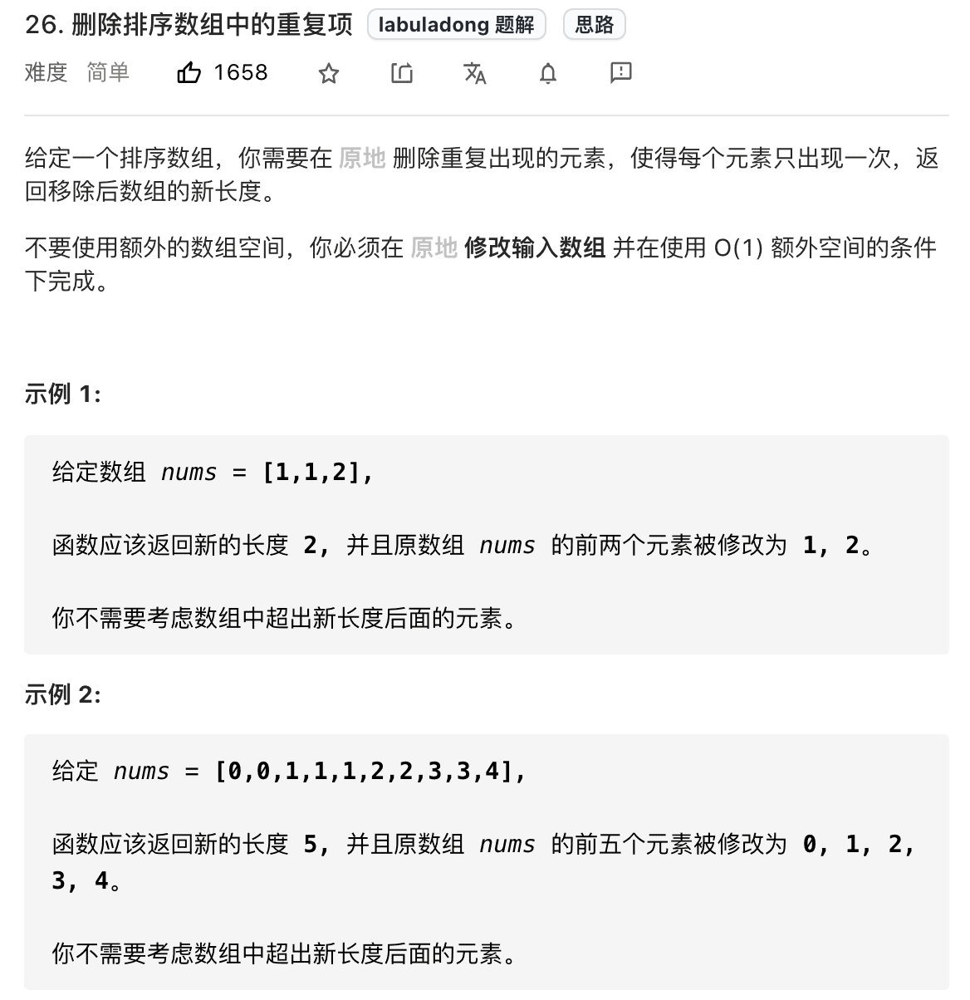
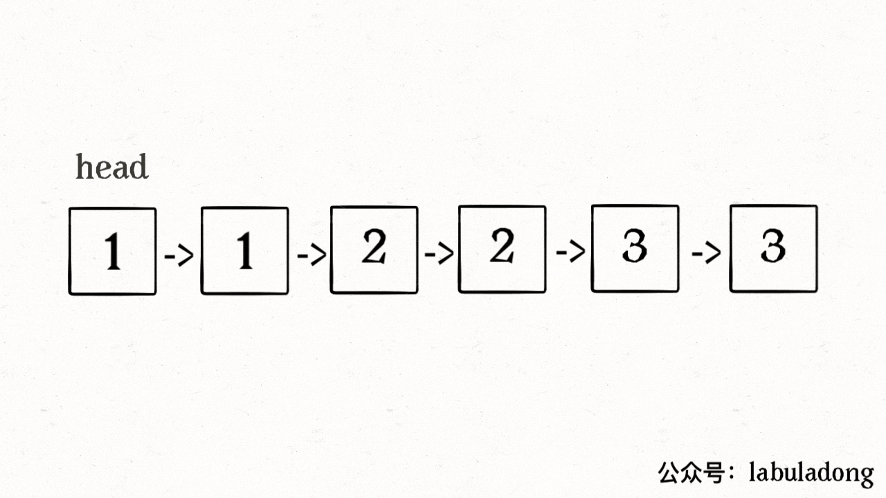
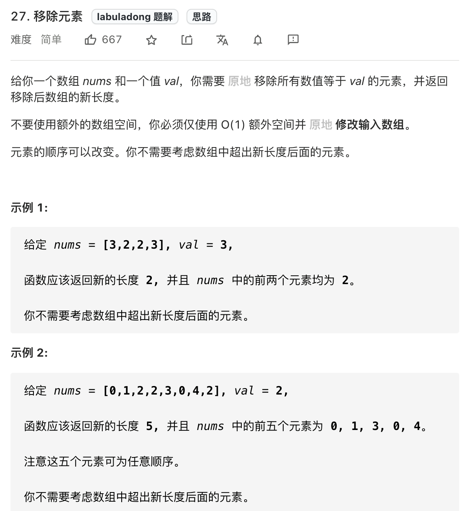
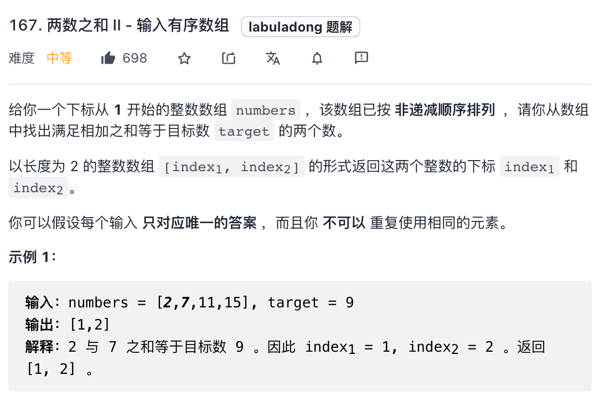
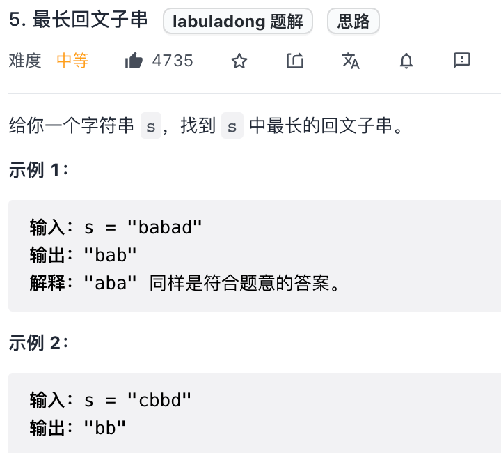

双指针技巧秒杀七道数组题目
======
> https://labuladong.github.io/algo/2/18/21/


读完本文，你不仅学会了**算法套路**，还可以顺便解决如下题目：

[5. 最长回文子串](https://leetcode.cn/problems/longest-palindromic-substring/)

[26. 删除有序数组中的重复项](https://leetcode.cn/problems/remove-duplicates-from-sorted-array/)

[27. 移除元素](https://leetcode.cn/problems/remove-element/)

[83. 删除排序链表中的重复元素](https://leetcode.cn/problems/remove-duplicates-from-sorted-list/)

[167. 两数之和 II - 输入有序数组](https://leetcode.cn/problems/two-sum-ii-input-array-is-sorted/)

[283. 移动零](https://leetcode.cn/problems/move-zeroes/)

[344. 反转字符串](https://leetcode.cn/problems/reverse-string/)

**-----------**

在处理**数组和链表**相关问题时，双指针技巧是经常用到的，
双指针技巧主要分为两类：**左右指针**和**快慢指针**。

所谓**左右指针**，就是**两个指针相向而行或者相背而行；**
而所谓**快慢指针**，就是**两个指针同向而行，一快一慢。**

对于**单链表**来说，大部分技巧都属于**快慢指针**，
前文 [单链表的六大解题套路](https://labuladong.github.io/algo/2/17/16/) 
都涵盖了，比如链表环判断，倒数第 `K` 个链表节点等问题，
它们都是通过一个 `fast` 快指针和一个 `slow` 慢指针配合完成任务。

在数组中并没有真正意义上的指针，但我们可以**把索引当做数组中的指针，**
这样也可以在数组中施展双指针技巧，本文主要讲**数组相关的双指针算法。**


# 一、快慢指针技巧
**数组问题中比较常见的快慢指针技巧，是让你原地修改数组**。
比如说看下力扣第 26 题「删除有序数组中的重复项」，让你在有序数组去重：



函数签名如下：

```java
int removeDuplicates(int[] nums);
```

简单解释一下什么是原地修改：

如果不是原地修改的话，我们直接 new 一个 `int[]` 数组，
把去重之后的元素放进这个新数组中，然后返回这个新数组即可。

但是现在题目让你原地删除，不允许 new 新数组，只能在原数组上操作，然后返回一个长度，
这样就可以通过返回的长度和原始数组得到我们去重后的元素有哪些了。

由于数组已经排序，所以重复的元素一定连在一起，找出它们并不难。
但如果毎找到一个重复元素就立即原地删除它，由于数组中删除元素涉及数据搬移，
整个时间复杂度是会达到 `O(N^2)`。

**高效解决这道题就要用到快慢指针技巧**：

我们让慢指针 `slow` 走在后面，快指针 `fast` 走在前面探路，
找到一个不重复的元素就赋值给 `slow` 并让 `slow` 前进一步。

这样，就保证了 `nums[0..slow]` 都是无重复的元素，
当 `fast` 指针遍历完整个数组 `nums` 后，`nums[0..slow]` 就是整个数组去重之后的结果。

看代码：

```java
int removeDuplicates(int[] nums) {
    if (nums.length == 0) {
        return 0;
    }
    int slow = 0, fast = 0;
    while (fast < nums.length) {
        if (nums[fast] != nums[slow]) {
            slow++;
            // 维护 nums[0..slow] 无重复
            nums[slow] = nums[fast];
        }
        fast++;
    }
    // 数组长度为索引 + 1
    return slow + 1;
}
```

算法执行的过程如下 GIF 图：


再简单扩展一下，看看力扣第 83 题「删除排序链表中的重复元素」，
如果给你一个有序的单链表，如何去重呢？

其实和数组去重是一模一样的，唯一的区别是把数组赋值操作变成操作指针而已，
你对照着之前的代码来看：

```java
ListNode deleteDuplicates(ListNode head) {
    if (head == null) return null;
    ListNode slow = head, fast = head;
    while (fast != null) {
        if (fast.val != slow.val) {
            // nums[slow] = nums[fast];
            slow.next = fast;
            // slow++;
            slow = slow.next;
        }
        // fast++
        fast = fast.next;
    }
    // 断开与后面重复元素的连接
    slow.next = null;
    return head;
}
```

算法执行的过程请看下面这个 GIF：



这里可能有读者会问，链表中那些重复的元素并没有被删掉，
就让这些节点在链表上挂着，合适吗？

这就要探讨不同语言的特性了，像 Java/Python 这类带有垃圾回收的语言，
可以帮我们自动找到并回收这些「悬空」的链表节点的内存，
而像 C++ 这类语言没有自动垃圾回收的机制，确实需要我们编写代码时手动释放掉这些节点的内存。

不过话说回来，就算法思维的培养来说，我们只需要知道这种快慢指针技巧即可。

**除了让你在有序数组/链表中去重，题目还可能让你对数组中的某些元素进行「原地删除」**。

比如力扣第 27 题「移除元素」，看下题目：



函数签名如下：

```java
int removeElement(int[] nums, int val);
```

题目要求我们把 `nums` 中所有值为 `val` 的元素原地删除，依然需要使用快慢指针技巧：

如果 `fast` 遇到值为 `val` 的元素，则直接跳过，
否则就赋值给 `slow` 指针，并让 `slow` 前进一步。

这和前面说到的数组去重问题解法思路是完全一样的，
就不画 GIF 了，直接看代码：

```java
int removeElement(int[] nums, int val) {
    int fast = 0, slow = 0;
    while (fast < nums.length) {
        if (nums[fast] != val) {
            nums[slow] = nums[fast];
            slow++;
        }
        fast++;
    }
    return slow;
}
```

注意这里和有序数组去重的解法有一个细节差异，
我们这里是先给 `nums[slow]` 赋值然后再给 `slow++`，
这样可以保证 `nums[0..slow-1]` 是不包含值为 `val` 的元素的，
最后的结果数组长度就是 `slow`。

实现了这个 `removeElement` 函数，
接下来看看力扣第 283 题「移动零」：

给你输入一个数组 `nums`，请你**原地修改**，将数组中的所有值为 0 的元素移到数组末尾，
函数签名如下：

```java
void moveZeroes(int[] nums);
```

比如说给你输入 `nums = [0,1,4,0,2]`，你的算法没有返回值，
但是会把 `nums` 数组原地修改成 `[1,4,2,0,0]`。

结合之前说到的几个题目，你是否有已经有了答案呢？

题目让我们将所有 0 移到最后，其实就相当于移除 `nums` 中的所有 0，
然后再把后面的元素都赋值为 0 即可。

所以我们可以复用上一题的 `removeElement` 函数：

```java
void moveZeroes(int[] nums) {
    // 去除 nums 中的所有 0，返回不含 0 的数组长度
    int p = removeElement(nums, 0);
    // 将 nums[p..] 的元素赋值为 0
    for (; p < nums.length; p++) {
        nums[p] = 0;
    }
}

// 见上文代码实现
int removeElement(int[] nums, int val);
```

到这里，原地修改数组的这些题目就已经差不多了。
数组中另一大类**快慢指针的题目就是「滑动窗口算法」。**

我在另一篇文章 [滑动窗口算法核心框架详解](https://labuladong.github.io/algo/2/18/25/) 
给出了**滑动窗口的代码框架**：

```cpp
/* 滑动窗口算法框架 */
void slidingWindow(string s, string t) {
    unordered_map<char, int> need, window;
    for (char c : t) need[c]++;
    
    int left = 0, right = 0;
    int valid = 0; 
    while (right < s.size()) {
        char c = s[right];
        // 右移（增大）窗口
        right++;
        // 进行窗口内数据的一系列更新

        while (window needs shrink) {
            char d = s[left];
            // 左移（缩小）窗口
            left++;
            // 进行窗口内数据的一系列更新
        }
    }
}
```

具体的题目本文就不重复了，这里只强调**滑动窗口算法的快慢指针特性**：

`left` 指针在后，`right` 指针在前，两个指针中间的部分就是「**窗口**」，
算法**通过扩大和缩小「窗口」来解决某些问题。**


# 二、左右指针的常用算法

## 1、二分查找

我在另一篇文章 [二分查找框架详解](https://labuladong.github.io/algo/2/18/26/) 
中有详细探讨二分搜索代码的细节问题，这里只写最简单的二分算法，
**旨在突出它的双指针特性**：

```java
int binarySearch(int[] nums, int target) {
    // 一左一右两个指针相向而行
    int left = 0, right = nums.length - 1;
    while(left <= right) {
        int mid = (right + left) / 2;
        if(nums[mid] == target)
            return mid; 
        else if (nums[mid] < target)
            left = mid + 1; 
        else if (nums[mid] > target)
            right = mid - 1;
    }
    return -1;
}
```

## 2、两数之和

看下力扣第 167 题「两数之和 II」：



只要**数组有序**，就应该想到**双指针技巧**。
这道题的解法有点类似二分查找，通过调节 `left` 和 `right` 就可以调整 `sum` 的大小：

```java
int[] twoSum(int[] nums, int target) {
    // 一左一右两个指针相向而行
    int left = 0, right = nums.length - 1;
    while (left < right) {
        int sum = nums[left] + nums[right];
        if (sum == target) {
            // 题目要求的索引是从 1 开始的
            return new int[]{left + 1, right + 1};
        } else if (sum < target) {
            left++; // 让 sum 大一点
        } else if (sum > target) {
            right--; // 让 sum 小一点
        }
    }
    return new int[]{-1, -1};
}
```

我在另一篇文章 [一个函数秒杀所有 nSum 问题](https://labuladong.github.io/algo/1/14/) 
中也**运用类似的左右指针技巧给出了 `nSum` 问题的一种通用思路**，这里就不做赘述了。

## 3、反转数组

一般编程语言都会提供 `reverse` 函数，其实这个函数的原理非常简单，
力扣第 344 题「反转字符串」就是类似的需求，
让你反转一个 `char[]` 类型的字符数组，
我们直接看代码吧：

```java
void reverseString(char[] s) {
    // 一左一右两个指针相向而行
    int left = 0, right = s.length - 1;
    while (left < right) {
        // 交换 s[left] 和 s[right]
        char temp = s[left];
        s[left] = s[right];
        s[right] = temp;
        left++;
        right--;
    }
}
```

## 4、回文串判断

首先明确一下，回文串就是正着读和反着读都一样的字符串。

比如说字符串 `aba` 和 `abba` 都是回文串，因为它们对称，反过来还是和本身一样；
反之，字符串 `abac` 就不是回文串。

现在你应该能感觉到**回文串问题和左右指针**肯定有密切的联系，
比如让你判断一个字符串是不是回文串，你可以写出下面这段代码：

> [125. 验证回文串](https://leetcode.cn/problems/valid-palindrome/)

```java
boolean isPalindrome(String s) {
    // 一左一右两个指针相向而行
    int left = 0, right = s.length() - 1;
    while (left < right) {
        if (s.charAt(left) != s.charAt(right)) {
            return false;
        }
        left++;
        right--;
    }
    return true;
}
```

那接下来我提升一点难度，给你一个字符串，让你用双指针技巧从中找出最长的回文串，你会做吗？

这就是力扣第 5 题「最长回文子串」：



函数签名如下：

```java
String longestPalindrome(String s);
```

**找回文串的难点在于，回文串的的长度可能是奇数也可能是偶数，**
**解决该问题的核心**是**从中心向两端扩散的双指针技巧**。

**如果回文串的长度为奇数，则它有一个中心字符；
如果回文串的长度为偶数，则可以认为它有两个中心字符。**
所以我们可以先实现这样一个函数：

```java
// 在 s 中寻找以 s[l] 和 s[r] 为中心的最长回文串
String palindrome(String s, int l, int r) {
    // 防止索引越界
    while (l >= 0 && r < s.length()
            && s.charAt(l) == s.charAt(r)) {
        // 双指针，向两边展开
        l--; r++;
    }
    // 返回以 s[l] 和 s[r] 为中心的最长回文串
    return s.substring(l + 1, r);
}
```

这样，**如果输入相同的 `l` 和 `r`，就相当于寻找长度为奇数的回文串，
如果输入相邻的 `l` 和 `r`，则相当于寻找长度为偶数的回文串。**

那么回到最长回文串的问题，解法的大致思路就是：

```python
for 0 <= i < len(s):
    找到以 s[i] 为中心的回文串
    找到以 s[i] 和 s[i+1] 为中心的回文串
    更新答案
```

翻译成代码，就可以解决最长回文子串这个问题：

```java
String longestPalindrome(String s) {
    String res = "";
    for (int i = 0; i < s.length(); i++) {
        // 以 s[i] 为中心的最长回文子串
        String s1 = palindrome(s, i, i);
        // 以 s[i] 和 s[i+1] 为中心的最长回文子串
        String s2 = palindrome(s, i, i + 1);
        // res = longest(res, s1, s2)
        res = res.length() > s1.length() ? res : s1;
        res = res.length() > s2.length() ? res : s2;
    }
    return res;
}
```

你应该能发现**最长回文子串使用的左右指针和之前题目的左右指针有一些不同：
之前的左右指针都是从两端向中间相向而行，而回文子串问题则是让左右指针从中心向两端扩展。**
不过这种情况也就回文串这类问题会遇到，所以我也把它归为左右指针了。

到这里，数组相关的双指针技巧就全部讲完了，
希望大家以后**遇到类似的算法问题时能够活学活用，举一反三。**

