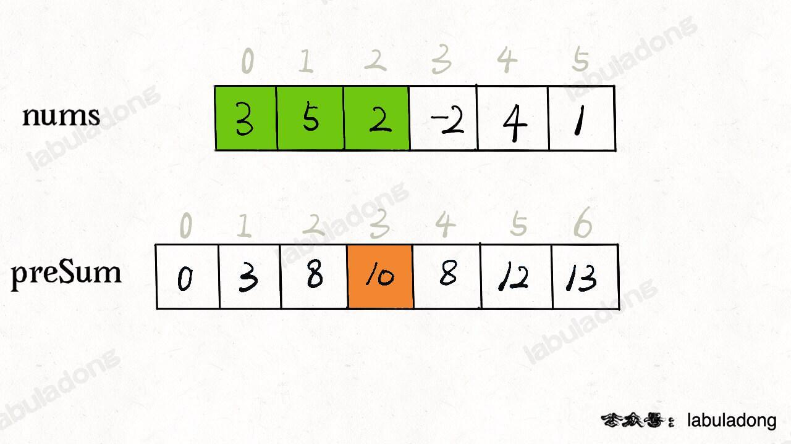
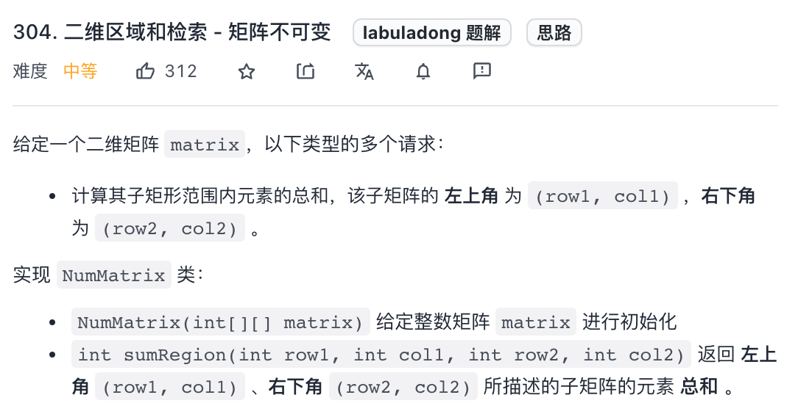

小而美的算法技巧：前缀和数组
======
> https://labuladong.github.io/algo/2/18/22/


读完本文，你不仅学会了算法套路，还可以顺便解决如下题目：

[303. 区域和检索 - 数组不可变](https://leetcode.cn/problems/range-sum-query-immutable/)

[304. 二维区域和检索 - 矩阵不可变](https://leetcode.cn/problems/range-sum-query-2d-immutable/)

**-----------**

**前缀和技巧适用于快速、频繁地计算一个索引区间内的元素之和。**


# 一维数组中的前缀和

先看一道例题，力扣第 303 题「区域和检索 - 数组不可变」，
让你计算数组区间内元素的和，这是一道标准的前缀和问题：


题目要求你实现这样一个类：

```java
class NumArray {

    public NumArray(int[] nums) {}
    
    /* 查询闭区间 [left, right] 的累加和 */
    public int sumRange(int left, int right) {}
}
```

`sumRange` 函数需要计算并返回一个索引区间之内的元素和，没学过前缀和的人可能写出如下代码：

```java
class NumArray {

    private int[] nums;

    public NumArray(int[] nums) {
        this.nums = nums;
    }
    
    public int sumRange(int left, int right) {
        int res = 0;
        for (int i = left; i <= right; i++) {
            res += nums[i];
        }
        return res;
    }
}
```

这样，可以达到效果，但是效率很差，因为 `sumRange` 方法会被频繁调用，
而它的时间复杂度是 `O(N)`，其中 `N` 代表 `nums` 数组的长度。

**这道题的最优解法是使用前缀和技巧，将 `sumRange` 函数的时间复杂度降为 `O(1)`，**
说白了就是不要在 `sumRange` 里面用 for 循环，咋整？

直接看代码实现：

```java
class NumArray {
    // 前缀和数组
    private int[] preSum;

    /* 输入一个数组，构造前缀和 */
    public NumArray(int[] nums) {
        // preSum[0] = 0，便于计算累加和
        preSum = new int[nums.length + 1];
        // 计算 nums 的累加和
        for (int i = 1; i < preSum.length; i++) {
            preSum[i] = preSum[i - 1] + nums[i - 1];
        }
    }
    
    /* 查询闭区间 [left, right] 的累加和 */
    public int sumRange(int left, int right) {
        return preSum[right + 1] - preSum[left];
    }
}
```

**核心思路是我们 new 一个新的数组 `preSum` 出来，`preSum[i]` 记录 `nums[0..i-1]` 的累加和，**
看图 10 = 3 + 5 + 2：



看这个 `preSum` 数组，如果我想求索引区间 `[1, 4]` 内的所有元素之和，就可以通过 `preSum[5] - preSum[1]` 得出。

这样，`sumRange` 函数仅仅需要做一次减法运算，避免了每次进行 for 循环调用，最坏时间复杂度为常数 `O(1)`。

这个技巧在生活中运用也挺广泛的，比方说，你们班上有若干同学，每个同学有一个期末考试的成绩（满分 100 分），
那么请你实现一个 API，输入任意一个分数段，返回有多少同学的成绩在这个分数段内。

那么，你可以先通过计数排序的方式计算每个分数具体有多少个同学，
然后利用前缀和技巧来实现分数段查询的 API：

```java
int[] scores; // 存储着所有同学的分数
// 试卷满分 100 分
int[] count = new int[100 + 1]
// 记录每个分数有几个同学
for (int score : scores)
    count[score]++
// 构造前缀和
for (int i = 1; i < count.length; i++)
    count[i] = count[i] + count[i-1];

// 利用 count 这个前缀和数组进行分数段查询
```

接下来，我们看一看**前缀和思路在二维数组中如何运用。**


# 二维矩阵中的前缀和

这是力扣第 304 题「二维区域和检索 - 矩阵不可变」，其实和上一题类似，
上一题是让你计算子数组的元素之和，这道题让你计算二维矩阵中子矩阵的元素之和：



比如说输入的 `matrix` 如下图：


按照题目要求，矩阵左上角为坐标原点 `(0, 0)`，
那么 `sumRegion([2,1,4,3])` 就是图中红色的子矩阵，你需要返回该子矩阵的元素和 8。

当然，你可以用一个嵌套 for 循环去遍历这个矩阵，
但这样的话 `sumRegion` 函数的时间复杂度就高了，你算法的格局就低了。

**做这道题更好的思路和一维数组中的前缀和是非常类似的**，如下图：


如果我想计算红色的这个子矩阵的元素之和，可以用绿色矩阵减去蓝色矩阵减去橙色矩阵最后加上粉色矩阵，
而绿蓝橙粉这四个矩阵有一个共同的特点，就是左上角就是 `(0, 0)` 原点。

那么我们可以维护一个二维 `preSum` 数组，专门记录以原点为顶点的矩阵的元素之和，
就可以用几次加减运算算出任何一个子矩阵的元素和：

```java
class NumMatrix {
    // 定义：preSum[i][j] 记录 matrix 中子矩阵 [0, 0, i-1, j-1] 的元素和
    private int[][] preSum;
    
    public NumMatrix(int[][] matrix) {
        int m = matrix.length, n = matrix[0].length;
        if (m == 0 || n == 0) return;
        // 构造前缀和矩阵
        preSum = new int[m + 1][n + 1];
        for (int i = 1; i <= m; i++) {
            for (int j = 1; j <= n; j++) {
                // 计算每个矩阵 [0, 0, i, j] 的元素和
                preSum[i][j] = preSum[i-1][j] + preSum[i][j-1] + matrix[i - 1][j - 1] - preSum[i-1][j-1];
            }
        }
    }
    
    // 计算子矩阵 [x1, y1, x2, y2] 的元素和
    public int sumRegion(int x1, int y1, int x2, int y2) {
        // 目标矩阵之和由四个相邻矩阵运算获得
        return preSum[x2+1][y2+1] - preSum[x1][y2+1] - preSum[x2+1][y1] + preSum[x1][y1];
    }
}
```

这样，`sumRegion` 函数的时间复杂度也用前缀和技巧优化到了 O(1)，这是**典型的「空间换时间」思路。**

前缀和技巧就讲到这里，应该说这个算法技巧是会者不难难者不会，
**实际运用中还是要多培养自己的思维灵活性，做到一眼看出题目是一个前缀和问题。**

另外，前缀和数组经常和其他数据结构或算法技巧相结合，
我会在 [数据结构精品课](https://appktavsiei5995.pc.xiaoe-tech.com/) 的 
[前缀和数组运用](https://appktavsiei5995.pc.xiaoe-tech.com/) 
一章举例讲解。

接下来可阅读：
* [差分数组技巧](https://labuladong.github.io/algo/2/18/23/)

