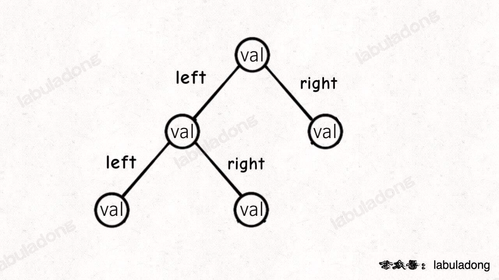
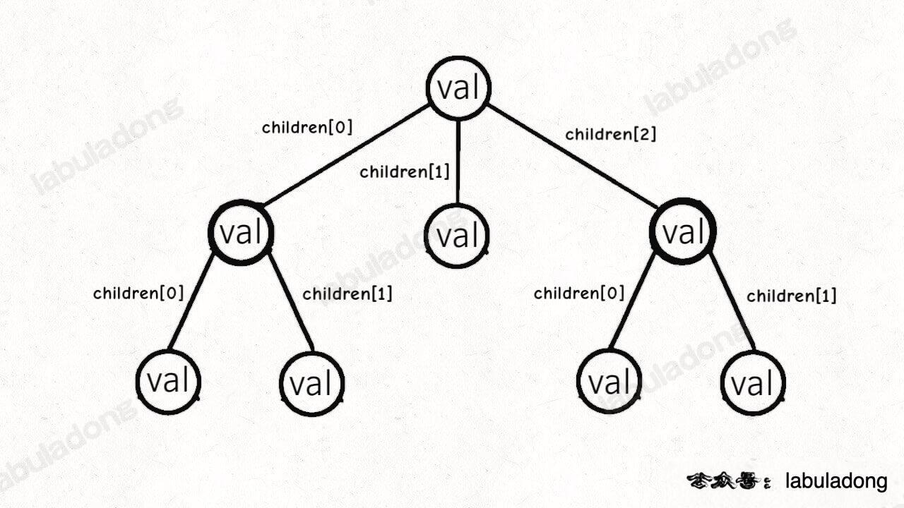
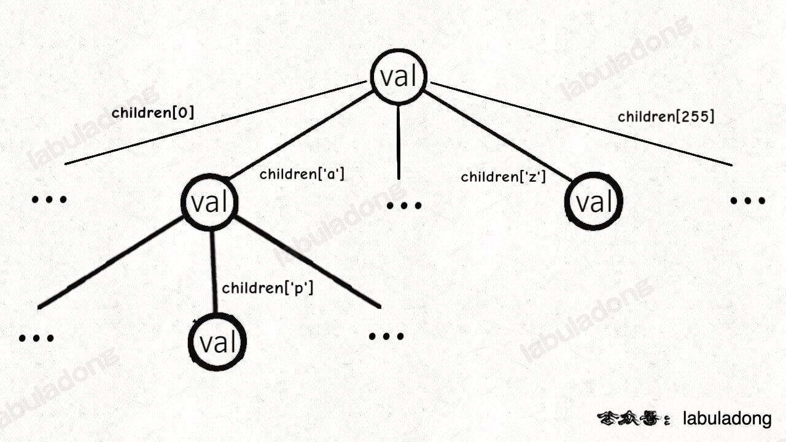
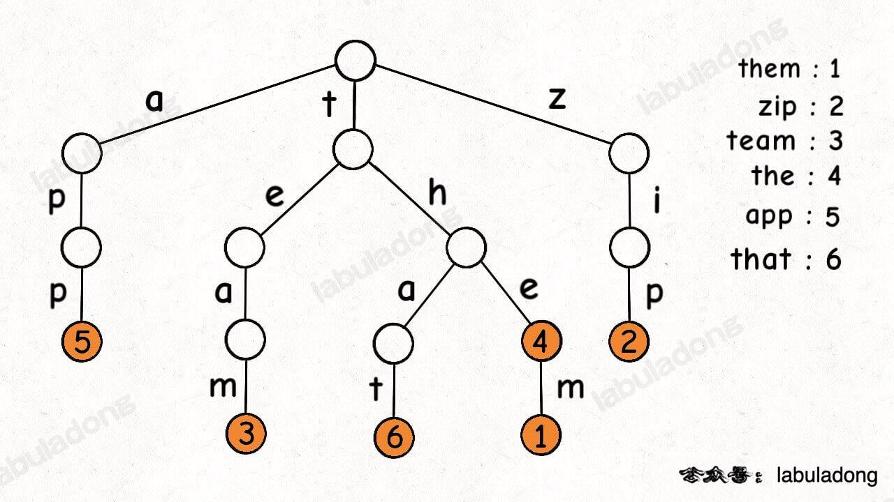
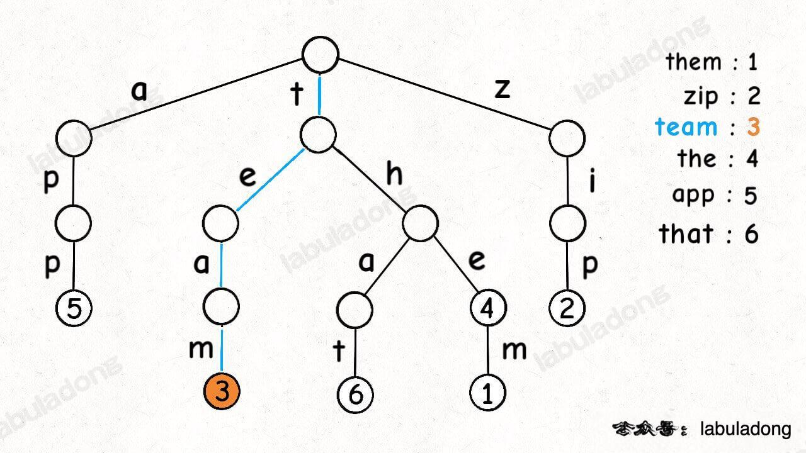
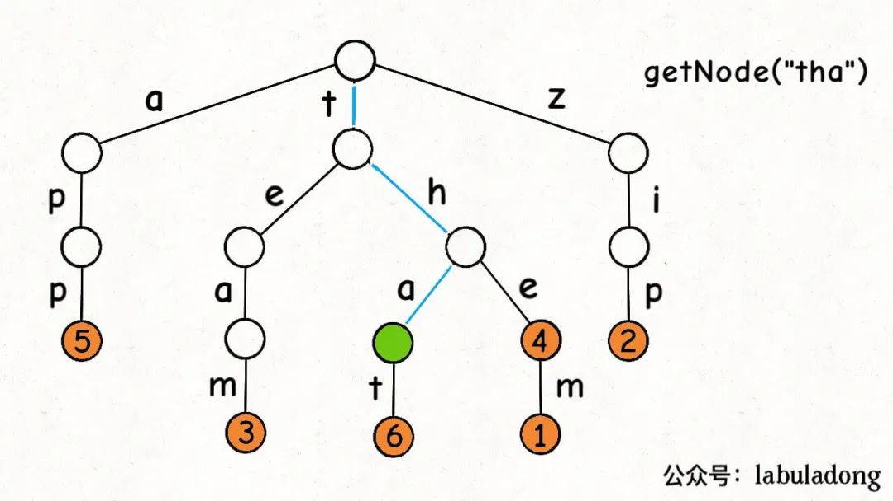

前缀树算法模板秒杀五道算法题
======
> https://labuladong.github.io/algo/2/21/58/
> [前缀树算法模板秒杀 5 道算法题](https://mp.weixin.qq.com/s/hGrTUmM1zusPZZ0nA9aaNw)


读完本文，你不仅学会了算法套路，还可以顺便解决如下题目：

[208. 实现 Trie](https://leetcode.cn/problems/implement-trie-prefix-tree/)

[1804. 实现 Trie II](https://leetcode.cn/problems/implement-trie-ii-prefix-tree/)

[648. 单词替换](https://leetcode.cn/problems/replace-words/)

[211. 添加与搜索单词](https://leetcode.cn/problems/design-add-and-search-words-data-structure/)

[677. 键值映射](https://leetcode.cn/problems/map-sum-pairs/)

**-----------**

**Trie 树又叫字典树、前缀树、单词查找树**，是一种二叉树衍生出来的高级数据结构，
**主要应用场景是处理字符串前缀相关的操作。**

我是在《算法 4》第一次学到这种数据结构，不过书中的讲解不是特别通俗易懂，
所以本文按照我的逻辑帮大家重新梳理一遍 **Trie 树的原理**，
并基于《算法 4》的代码实现一套更通用易懂的代码模板，用于处理力扣上一系列**字符串前缀问题**。

阅读本文之前希望你读过我旧文讲过的 [回溯算法代码模板](https://labuladong.github.io/algo/4/29/103/) 
和 [手把手刷二叉树（总结篇）](https://labuladong.github.io/algo/2/19/33/) 。

本文主要分三部分：

**1、讲解 Trie 树的工作原理**。

**2、给出一套 `TrieMap` 和 `TrieSet` 的代码模板，实现几个常用 API**。

**3、实践环节，直接套代码模板秒杀 5 道算法题**。
本来可以秒杀七八道题，篇幅考虑，剩下的我集成到 刷题插件 中。

关于 `Map` 和 `Set`，是两个抽象数据结构（接口），
`Map` 存储一个键值对集合，其中键不重复，
`Set` 存储一个不重复的元素集合。

常见的 `Map` 和 `Set` 的底层实现原理有**哈希表和二叉搜索树**两种，
比如 Java 的 HashMap/HashSet 和 C++ 的 unorderd_map/unordered_set 底层就是用哈希表实现，
而 Java 的 TreeMap/TreeSet 和 C++ 的 map/set 底层使用红黑树这种自平衡 BST 实现的。

而本文实现的 TrieSet/TrieMap 底层则用 Trie 树这种结构来实现。

了解数据结构的读者应该知道，本质上 `Set` 可以视为一种特殊的 `Map`，`Set` 其实就是 `Map` 中的键。

**所以本文先实现 `TrieMap`，然后在 `TrieMap` 的基础上封装出 `TrieSet`**。

PS：为了模板通用性的考虑，后文会用到 Java 的泛型，也就是用尖括号 `<>` 指定的类型变量。
这些类型变量的作用是指定我们实现的容器中存储的数据类型，类比 Java 标准库的那些容器的用法应该不难理解。

前文 [学习数据结构的框架思维](https://labuladong.github.io/algo/1/2/) 说过，
各种乱七八糟的结构都是为了在「特定场景」下尽可能高效地进行增删查改。

你比如 `HashMap<K, V>` 的优势是能够在 O(1) 时间通过键查找对应的值，但要求**键的类型** `K` 必须是「**可哈希**」的；
而 `TreeMap<K, V>` 的特点是方便根据键的大小进行操作，但要求键的类型 `K` 必须是「**可比较**」的。

本文要实现的 `TrieMap` 也是类似的，由于 Trie 树原理，
我们要求 `TrieMap<V>` 的键必须是**字符串类型**，值的类型 `V` 可以随意。

接下来我们了解一下 Trie 树的原理，看看为什么这种数据结构能够高效操作字符串。


# Trie 树原理

**Trie 树本质上就是一棵从二叉树衍生出来的多叉树**。

二叉树节点的代码实现是这样：

```java
/* 基本的二叉树节点 */
class TreeNode {
    int val;
    TreeNode left, right;
}
```

其中 `left, right` 存储左右子节点的指针，所以二叉树的结构是这样：



多叉树节点的代码实现是这样：

```
/* 基本的多叉树节点 */
class TreeNode {
    int val;
    TreeNode[] children;
}
```

其中 `children` 数组中存储指向孩子节点的指针，所以多叉树的结构是这样：



而 `TrieMap` 中的树节点 `TrieNode` 的代码实现是这样：

```
/* Trie 树节点实现 */
class TrieNode<V> {
    V val = null;
    TrieNode<V>[] children = new TrieNode[256];
}
```

这个 `val` 字段存储键对应的值，`children` 数组存储指向子节点的指针。

**但是和之前的普通多叉树节点不同，`TrieNode` 中 `children` 数组的索引是有意义的，代表键中的一个字符**。

比如说 `children[97]` 如果非空，说明这里存储了一个字符 `'a'`，因为 `'a'` 的 ASCII 码为 97。

我们的模板只考虑处理 ASCII 字符，所以 `children` 数组的大小设置为 256。
不过这个可以根据具体问题修改，比如改成更小的数组或者 `HashMap<Character, TrieNode>` 都是一样的效果。

有了以上铺垫，**Trie 树的结构**是这样的：



一个节点有 256 个子节点指针，但大多数时候都是空的，可以省略掉不画，
**所以一般你看到的 Trie 树长这样**：



这是在 `TrieMap<Integer>` 中插入一些键值对后的样子，
白色节点代表 `val` 字段为空，橙色节点代表 `val` 字段非空。

**这里要特别注意，`TrieNode` 节点本身只存储 `val` 字段，并没有一个字段来存储字符，
字符是通过子节点在父节点的 `children` 数组中的索引确定的**。

形象理解就是，**Trie 树用「树枝」存储字符串（键），用「节点」存储字符串（键）对应的数据（值）**。
所以我在图中**把字符标在树枝，键对应的值 `val` 标在节点上**：



明白这一点很重要，有助于之后你理解代码实现。

PS：《算法 4》以及网上讲 Trie 树的文章中都是把字符标在节点上，
我认为这样很容易让初学者产生误解，所以建议大家按照我的这种理解来记忆 Trie 树结构。

现在你应该知道**为啥 Trie 树也叫前缀树了，因为其中的字符串共享前缀，
相同前缀的字符串集中在 Trie 树中的一个子树上，给字符串的处理带来很大的便利。**


# TrieMap/TrieSet API 及实现

首先我们看一下本文实现的 `TrieMap` 的 API，为了举例 API 的功能，
假设 TrieMap 中已经存储了如下键值对：


```java
// 底层用 Trie 树实现的键值映射
// 键为 String 类型，值为类型 V
class TrieMap<V> {

    /***** 增/改 *****/

    // 在 Map 中添加 key
    public void put(String key, V val);

    /***** 删 *****/

    // 删除键 key 以及对应的值
    public void remove(String key);

    /***** 查 *****/

    // 搜索 key 对应的值，不存在则返回 null
    // get("the") -> 4
    // get("tha") -> null
    public V get(String key);

    // 判断 key 是否存在在 Map 中
    // containsKey("tea") -> false
    // containsKey("team") -> true
    public boolean containsKey(String key);

    // 在 Map 的所有键中搜索 query 的最短前缀
    // shortestPrefixOf("themxyz") -> "the"
    public String shortestPrefixOf(String query);

    // 在 Map 的所有键中搜索 query 的最长前缀
    // longestPrefixOf("themxyz") -> "them"
    public String longestPrefixOf(String query);

    // 搜索所有前缀为 prefix 的键
    // keysWithPrefix("th") -> ["that", "the", "them"]
    public List<String> keysWithPrefix(String prefix);

    // 判断是和否存在前缀为 prefix 的键
    // hasKeyWithPrefix("tha") -> true
    // hasKeyWithPrefix("apple") -> false
    public boolean hasKeyWithPrefix(String prefix);

    // 通配符 . 匹配任意字符，搜索所有匹配的键
    // keysWithPattern("t.a.") -> ["team", "that"]
    public List<String> keysWithPattern(String pattern);

    // 通配符 . 匹配任意字符，判断是否存在匹配的键
    // hasKeyWithPattern(".ip") -> true
    // hasKeyWithPattern(".i") -> false
    public boolean hasKeyWithPattern(String pattern);

    // 返回 Map 中键值对的数量
    public int size();
}
```

至于 `TrieSet` 的 API 大同小异，所以这里不重复列举，后文直接给出实现。

**接下来是重头戏，我们一个一个实现 `TrieMap` 的上述 API 函数**。

首先，`TrieMap` 类中一定需要记录 Trie 的根节点 `root`，
以及 Trie 树中的所有节点数量用于实现 `size()` 方法：

```java
class TrieMap<V> {
    // ASCII 码个数
    private static final int R = 256;
    // 当前存在 Map 中的键值对个数
    private int size = 0;

    private static class TrieNode<V> {
        V val = null;
        TrieNode<V>[] children = new TrieNode[R];
    }

    // Trie 树的根节点
    private TrieNode<V> root = null;

    /* 其他 API 的实现... */

    public int size() {
        return size;
    }
}
```

另外，我们再实现一个工具函数 `getNode`：

```java
// 从节点 node 开始搜索 key，如果存在返回对应节点，否则返回 null
private TrieNode<V> getNode(TrieNode<V> node, String key) {
    TrieNode<V> p = node;
    // 从节点 node 开始搜索 key
    for (int i = 0; i < key.length(); i++) {
        if (p == null) {
            // 无法向下搜索
            return null;
        }
        // 向下搜索
        char c = key.charAt(i);
        p = p.children[c];
    }
    return p;
}
```



有了这个 `getNode` 函数，就能实现 `containsKey` 方法和 `get` 方法了：

```java
// 搜索 key 对应的值，不存在则返回 null
public V get(String key) {
    // 从 root 开始搜索 key
    TrieNode<V> x = getNode(root, key);
    if (x == null || x.val == null) {
        // x 为空或 x 的 val 字段为空都说明 key 没有对应的值
        return null;
    }
    return x.val;
}

// 判断 key 是否存在在 Map 中
public boolean containsKey(String key) {
    return get(key) != null;
}
```

这里需要注意，就算 `getNode(key)` 的返回值 `x` 非空，也只能说字符串 `key` 是一个「前缀」；
除非 `x.val` 同时非空，才能判断键 `key` 存在。

不过，这个特性恰好能够帮我们实现 `hasKeyWithPrefix` 方法：

```java
// 判断是和否存在前缀为 prefix 的键
public boolean hasKeyWithPrefix(String prefix) {
    // 只要能找到 prefix 对应的节点，就是存在前缀
    return getNode(root, prefix) != null;
}
```

类似 `getNode` 方法的逻辑，我们可以实现 `shortestPrefixOf` 方法，
只要在第一次遇到存有 `val` 的节点的时候返回就行了：

```java
// 在所有键中寻找 query 的最短前缀
public String shortestPrefixOf(String query) {
    TrieNode<V> p = root;
    // 从节点 node 开始搜索 key
    for (int i = 0; i < query.length(); i++) {
        if (p == null) {
            // 无法向下搜索
            return "";
        }
        if (p.val != null) {
            // 找到一个键是 query 的前缀
            return query.substring(0, i);
        }
        // 向下搜索
        char c = query.charAt(i);
        p = p.children[c];
    }

    if (p != null && p.val != null) {
        // 如果 query 本身就是一个键
        return query;
    }
    return "";
}
```

**这里需要注意的是 for 循环结束之后我们还需要额外检查一下**。


