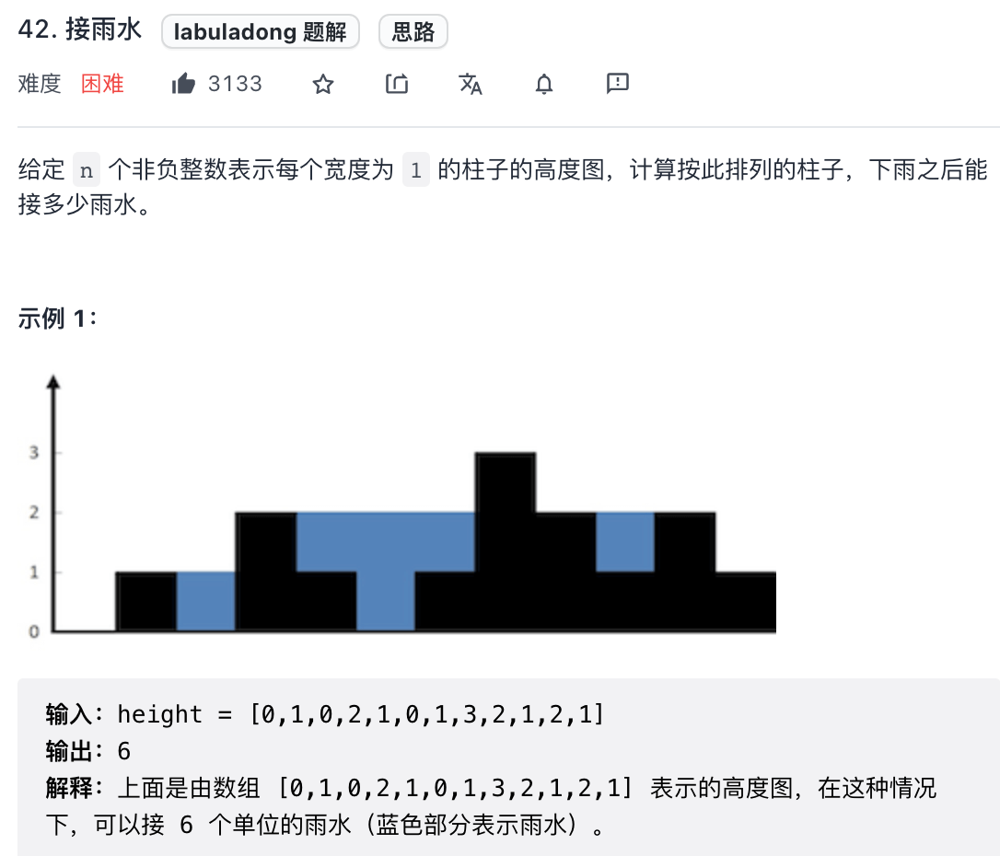
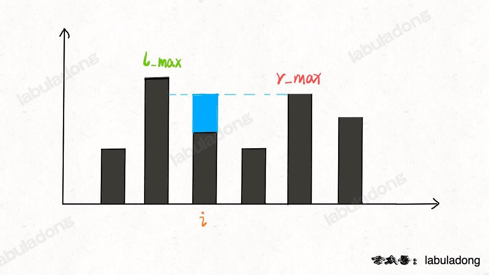
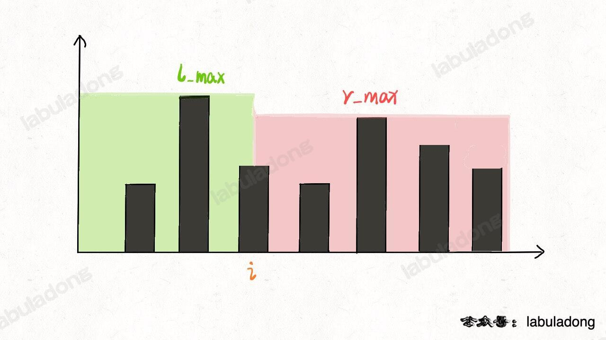
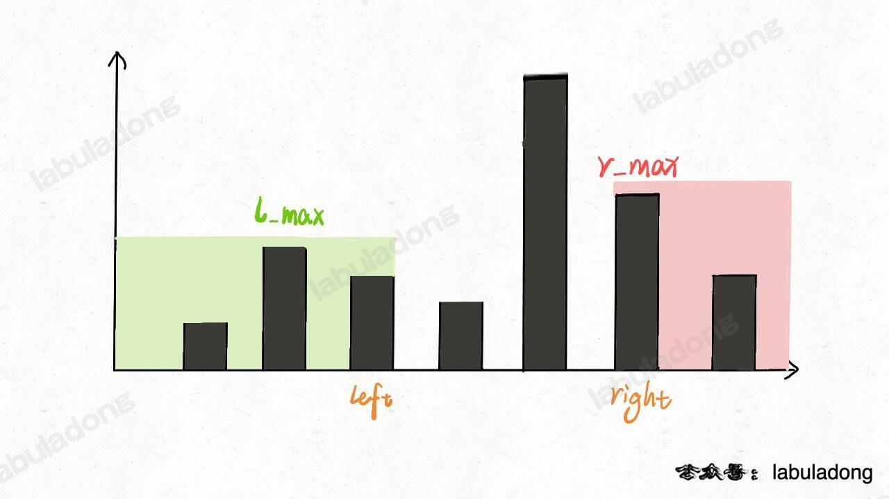
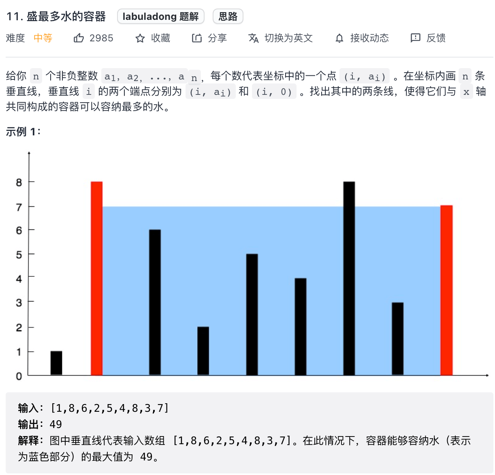

如何高效解决接雨水问题
======
> https://labuladong.github.io/algo/4/31/128/


读完本文，你不仅学会了**算法套路**，还可以顺便解决如下题目：

[11. 盛最多水的容器](https://leetcode.cn/problems/container-with-most-water/)

[42. 接雨水](https://leetcode.cn/problems/trapping-rain-water/)

**-----------**

力扣第 42 题「接雨水」挺有意思，在面试题中出现频率还挺高的，
本文就来步步优化，讲解一下这道题。

先看一下题目：



就是用一个数组表示一个条形图，问你这个条形图最多能接多少水。

```java
int trap(int[] height);
```

下面就来由浅入深介绍**暴力解法 -> 备忘录解法 -> 双指针解法**，在 O(N) 时间 O(1) 空间内解决这个问题。


# 一、核心思路

所以**对于这种问题，我们不要想整体，而应该去想局部；**
就像之前的文章写的**动态规划问题处理字符串问题，不要考虑如何处理整个字符串，而是去思考应该如何处理每一个字符。**

这么一想，可以发现这道题的思路其实很简单。
具体来说，仅仅对于位置 `i`，能装下多少水呢？


能装 2 格水，因为 `height[i]` 的高度为 0，而这里最多能盛 2 格水，2-0=2。

为什么位置 `i` 最多能盛 2 格水呢？
因为，位置 `i` 能达到的水柱高度和其左边的最高柱子、右边的最高柱子有关，
我们分别称这两个柱子高度为 `l_max` 和 `r_max`；
**位置 `i` 最大的水柱高度就是 `min(l_max, r_max)`**。

更进一步，对于位置 `i`，能够装的水为：

```python
water[i] = min(
               # 左边最高的柱子
               max(height[0..i]),  
               # 右边最高的柱子
               max(height[i..end]) 
            ) - height[i]
```




这就是**本问题的核心思路**，我们可以简单写一个暴力算法：

```java
int trap(int[] height) {
    int n = height.length;
    int res = 0;
    for (int i = 1; i < n - 1; i++) {
        int l_max = 0, r_max = 0;
        // 找右边最高的柱子
        for (int j = i; j < n; j++)
            r_max = Math.max(r_max, height[j]);
        // 找左边最高的柱子
        for (int j = i; j >= 0; j--)
            l_max = Math.max(l_max, height[j]);
        // 如果自己就是最高的话，
        // l_max == r_max == height[i]
        res += Math.min(l_max, r_max) - height[i];
    }
    return res;
}
```

有之前的思路，这个解法应该是很直接粗暴的，时间复杂度 O(N^2)，空间复杂度 O(1)。
但是很明显这种计算 `r_max` 和 `l_max` 的方式非常笨拙，一般的优化方法就是备忘录。


# 二、备忘录优化

之前的暴力解法，不是在每个位置 `i` 都要计算 `r_max` 和 `l_max` 吗？
我们直接把结果都提前计算出来，别傻不拉几的每次都遍历，这时间复杂度不就降下来了嘛。

**我们开两个数组 `r_max` 和 `l_max` 充当备忘录，
`l_max[i]` 表示位置 `i` 左边最高的柱子高度，`r_max[i]` 表示位置 `i` 右边最高的柱子高度**。
预先把这两个数组计算好，避免重复计算：

```java
int trap(int[] height) {
    if (height.length == 0) {
        return 0;
    }
    int n = height.length;
    int res = 0;
    // 数组充当备忘录
    int[] l_max = new int[n];
    int[] r_max = new int[n];
    // 初始化 base case
    l_max[0] = height[0];
    r_max[n - 1] = height[n - 1];
    // 从左向右计算 l_max
    for (int i = 1; i < n; i++)
        l_max[i] = Math.max(height[i], l_max[i - 1]);
    // 从右向左计算 r_max
    for (int i = n - 2; i >= 0; i--)
        r_max[i] = Math.max(height[i], r_max[i + 1]);
    // 计算答案
    for (int i = 1; i < n - 1; i++)
        res += Math.min(l_max[i], r_max[i]) - height[i];
    return res;
}
```

这个优化其实和暴力解法思路差不多，就是避免了重复计算，
把时间复杂度降低为 O(N)，已经是最优了，但是空间复杂度是 O(N)。
下面来看一个精妙一些的解法，能够把空间复杂度降低到 O(1)。


# 三、双指针解法

这种解法的思路是完全相同的，但在实现手法上非常巧妙，
我们这次也不要用备忘录提前计算了，而是用双指针**边走边算**，节省下空间复杂度。

首先，看一部分代码：

```java
int trap(int[] height) {
    int left = 0, right = height.length - 1;
    int l_max = 0, r_max = 0;
    
    while (left < right) {
        l_max = Math.max(l_max, height[left]);
        r_max = Math.max(r_max, height[right]);
        // 此时 l_max 和 r_max 分别表示什么？
        left++; right--;
    }
}
```

对于这部分代码，请问 `l_max` 和 `r_max` 分别表示什么意义呢？

很容易理解，**`l_max` 是 `height[0..left]` 中最高柱子的高度，
`r_max` 是 `height[right..end]` 的最高柱子的高度**。

明白了这一点，直接看解法：

```java
int trap(int[] height) {
    int left = 0, right = height.length - 1;
    int l_max = 0, r_max = 0;

    int res = 0;
    while (left < right) {
        l_max = Math.max(l_max, height[left]);
        r_max = Math.max(r_max, height[right]);

        // res += min(l_max, r_max) - height[i]
        if (l_max < r_max) {
            res += l_max - height[left];
            left++;
        } else {
            res += r_max - height[right];
            right--;
        }
    }
    return res;
}
```

你看，其中的核心思想和之前一模一样，换汤不换药。
但是细心的读者可能会发现次解法还是有点细节差异：

之前的备忘录解法，
`l_max[i]` 和 `r_max[i]` 分别代表 `height[0..i]` 和 `height[i..end]` 的最高柱子高度。

```java
res += Math.min(l_max[i], r_max[i]) - height[i];
```



但是双指针解法中，
`l_max` 和 `r_max` 代表的是 `height[0..left]` 和 `height[right..end]` 的最高柱子高度。
比如这段代码：

```java
if (l_max < r_max) {
    res += l_max - height[left];
    left++; 
}
```



此时的 `l_max` 是 `left` 指针左边的最高柱子，
但是 `r_max` 并不一定是 `left` 指针右边最高的柱子，
这真的可以得到正确答案吗？

其实这个问题要这么思考，我们只在乎 `min(l_max, r_max)`。
**对于上图的情况，我们已经知道 `l_max < r_max` 了，至于这个 `r_max` 是不是右边最大的，不重要。
重要的是 `height[i]` 能够装的水只和较低的 `l_max` 之差有关**：


这样，接雨水问题就解决了。


# 扩展延伸

下面我们看一道和接雨水问题非常类似的题目，力扣第 11 题「盛最多水的容器」：



函数签名如下：

```java
int maxArea(int[] height);
```

这题和接雨水问题很类似，可以完全套用前文的思路，而且还更简单。
两道题的区别在于：

**接雨水问题给出的类似一幅直方图，每个横坐标都有宽度，
而本题给出的每个横坐标是一条竖线，没有宽度**。

我们前文讨论了半天 `l_max` 和 `r_max`，实际上都是为了计算 `height[i]` 能够装多少水；
而本题中 `height[i]` 没有了宽度，那自然就好办多了。

举个例子，如果在接雨水问题中，你知道了 `height[left]` 和 `height[right]` 的高度，
你能算出 `left` 和 `right` 之间能够盛下多少水吗？

不能，因为你不知道 `left` 和 `right` 之间每个柱子具体能盛多少水，
你得通过每个柱子的 `l_max` 和 `r_max` 来计算才行。

反过来，就本题而言，你知道了 `height[left]` 和 `height[right]` 的高度，
能算出 `left` 和 `right` 之间能够盛下多少水吗？

可以，因为本题中竖线没有宽度，所以 `left` 和 `right` 之间能够盛的水就是：

```
min(height[left], height[right]) * (right - left)
```

类似接雨水问题，高度是由 `height[left]` 和 `height[right]` 较小的值决定的。

解决这道题的思路依然是**双指针**技巧：

**用 `left` 和 `right` 两个指针从两端向中心收缩，
一边收缩一边计算 `[left, right]` 之间的矩形面积，取最大的面积值即是答案**。

先直接看解法代码吧：

```java
int maxArea(int[] height) {
    int left = 0, right = height.length - 1;
    int res = 0;
    while (left < right) {
        // [left, right] 之间的矩形面积
        int cur_area = Math.min(height[left], height[right]) * (right - left);
        res = Math.max(res, cur_area);
        // 双指针技巧，移动较低的一边
        if (height[left] < height[right]) {
            left++;
        } else {
            right--;
        }
    }
    return res;
}
```

代码和接雨水问题大致相同，不过肯定有读者会问，下面这段 if 语句为什么要移动较低的一边：

```java
// 双指针技巧，移动较低的一边
if (height[left] < height[right]) {
    left++;
} else {
    right--;
}
```

**其实也好理解，因为矩形的高度是由 `min(height[left], height[right])` 即较低的一边决定的**：

你如果移动较低的那一边，那条边可能会变高，使得矩形的高度变大，进而就「有可能」使得矩形的面积变大；
相反，如果你去移动较高的那一边，矩形的高度是无论如何都不会变大的，所以不可能使矩形的面积变得更大。

至此，这道题也解决了。

