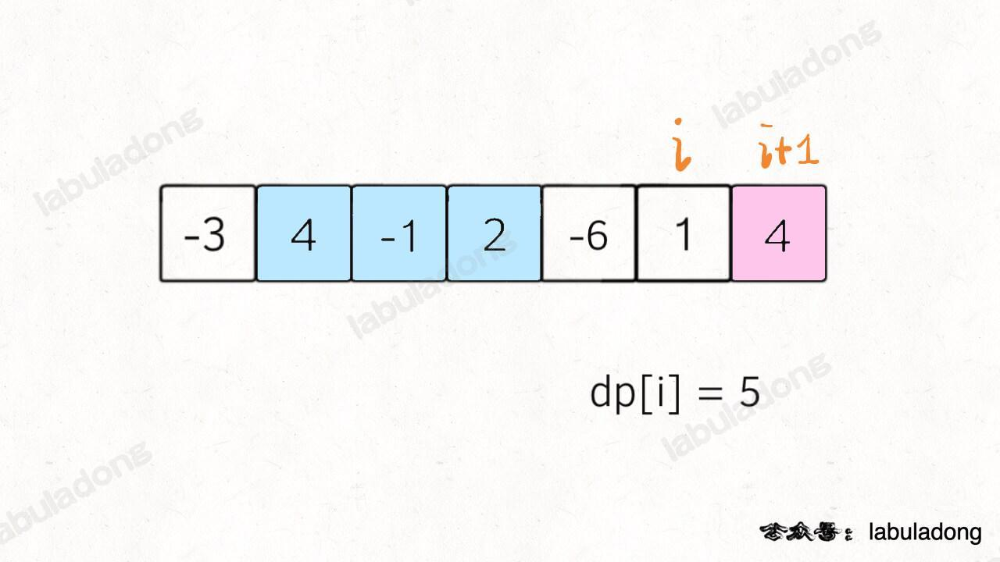

动态规划设计：最大子数组
======
> https://labuladong.github.io/algo/3/24/76/


读完本文，你不仅学会了算法套路，还可以顺便解决如下题目：

[53. 最大子数组和](https://labuladong.github.io/algo/3/24/76/)

**-----------**

力扣第 53 题「最大子序和」问题和前文讲过的 [经典动态规划：最长递增子序列](https://labuladong.github.io/algo/3/24/75/) 
的套路非常相似，代表着一类比较特殊的动态规划问题的思路，题目如下：

给你输入一个整数数组 `nums`，请你找在其中找一个和最大的子数组，返回这个子数组的和。
函数签名如下：

```java
int maxSubArray(int[] nums);
```

比如说输入 `nums = [-3,1,3,-1,2,-4,2]`，算法返回 5，因为最大子数组 `[1,3,-1,2]` 的和为 5。

其实第一次看到这道题，我首先想到的是 [滑动窗口算法](https://labuladong.github.io/algo/2/18/25/) ，
因为我们前文说过嘛，滑动窗口算法就是专门处理子串/子数组问题的，这里不就是子数组问题么？

但是，稍加分析就发现，**这道题还不能用滑动窗口算法，因为数组中的数字可以是负数**。

滑动窗口算法无非就是双指针形成的窗口扫描整个数组/子串，但关键是，
你得清楚地知道什么时候应该移动右侧指针来扩大窗口，什么时候移动左侧指针来减小窗口。
而对于这道题目，你想想，当窗口扩大的时候可能遇到负数，窗口中的值也就可能增加也可能减少，
这种情况下不知道什么时机去收缩左侧窗口，也就无法求出「最大子数组和」。


# 动态规划思路
解决这个问题可以用动态规划技巧解决，但是 `dp` 数组的定义比较特殊。
按照我们常规的动态规划思路，一般是这样定义 `dp` 数组：

**`nums[0..i]` 中的「最大的子数组和」为 `dp[i]`**。

如果这样定义的话，整个 `nums` 数组的「最大子数组和」就是 `dp[n-1]`。
**如何找状态转移方程呢？按照数学归纳法，假设我们知道了 `dp[i-1]`，如何推导出 `dp[i]` 呢？**

如下图，按照我们刚才对 `dp` 数组的定义，`dp[i] = 5` ，也就是等于 `nums[0..i]` 中的最大子数组和：



那么在上图这种情况中，利用数学归纳法，你能用 `dp[i]` 推出 `dp[i+1]` 吗？

**实际上是不行的，因为子数组一定是连续的，
按照我们当前 `dp` 数组定义，并不能保证 `nums[0..i]` 中的最大子数组与 `nums[i+1]` 是相邻的**，
也就没办法从 `dp[i]` 推导出 `dp[i+1]`。

所以说我们这样定义 `dp` 数组是不正确的，无法得到合适的状态转移方程。
对于这类子数组问题，我们就要重新定义 **dp 数组的含义**：

**以 `nums[i]` 为结尾的「最大子数组和」为 `dp[i]`**。

这种定义之下，想得到整个 `nums` 数组的「最大子数组和」，不能直接返回 `dp[n-1]`，
而需要遍历整个 `dp` 数组：

```java
int res = Integer.MIN_VALUE;
for (int i = 0; i < n; i++) {
    res = Math.max(res, dp[i]);
}
return res;
```

依然**使用数学归纳法来找状态转移关系：假设我们已经算出了 `dp[i-1]`，如何推导出 `dp[i]` 呢？**

可以做到，**`dp[i]` 有两种「选择」，要么与前面的相邻子数组连接，形成一个和更大的子数组；
要么不与前面的子数组连接，自成一派，自己作为一个子数组。**

**如何选择？既然要求「最大子数组和」，当然选择结果更大的那个**啦：

```java
// 要么自成一派，要么和前面的子数组合并
dp[i] = Math.max(nums[i], nums[i] + dp[i - 1]);
```

综上，我们已经写出了**状态转移方程**，就可以直接写出解法了：

```java
int maxSubArray(int[] nums) {
    int n = nums.length;
    if (n == 0) return 0;
    // 定义：dp[i] 记录以 nums[i] 为结尾的「最大子数组和」
    int[] dp = new int[n];
    // base case
    // 第一个元素前面没有子数组
    dp[0] = nums[0];
    // 状态转移方程
    for (int i = 1; i < n; i++) {
        dp[i] = Math.max(nums[i], nums[i] + dp[i - 1]);
    }
    // 得到 nums 的最大子数组
    int res = Integer.MIN_VALUE;
    for (int i = 0; i < n; i++) {
        res = Math.max(res, dp[i]);
    }
    return res;
}
```

以上解法时间复杂度是 O(N)，空间复杂度也是 O(N)，较暴力解法已经很优秀了，
**不过注意到 **dp[i]** 仅仅和 **dp[i-1]** 的状态有关**，那么我们可以施展前文 
[动态规划的降维打击：空间压缩技巧](https://labuladong.github.io/algo/3/23/70/) 
讲的技巧进行进一步优化，将空间复杂度降低：

```java
int maxSubArray(int[] nums) {
    int n = nums.length;
    if (n == 0) return 0;
    // base case
    int dp_0 = nums[0];
    int dp_1 = 0, res = dp_0;

    for (int i = 1; i < n; i++) {
        // dp[i] = max(nums[i], nums[i] + dp[i-1])
        dp_1 = Math.max(nums[i], nums[i] + dp_0);
        dp_0 = dp_1;
        // 顺便计算最大的结果
        res = Math.max(res, dp_1);
    }
    
    return res;
}
```


# 前缀和思路
在动态规划解法中，我们通过状态转移方程推导以 `nums[i]` 结尾的最大子数组和，
其实用前文 [小而美的算法技巧：前缀和数组](https://labuladong.github.io/algo/2/18/22/) 
讲过的前缀和数组也可以达到相同的效果。

回顾一下，前缀和数组 `preSum` 就是 `nums` 元素的累加和，
`preSum[i+1] - preSum[j]` 其实就是子数组 `nums[j..i]` 之和
（根据 `preSum` 数组的实现，索引 0 是占位符，所以 `i` 有一位索引偏移）。

**那么反过来想，以 `nums[i]` 为结尾的最大子数组之和是多少？
其实就是 `preSum[i+1] - min(preSum[0..i])`**。

所以，我们可以利用前缀和数组计算以每个元素结尾的子数组之和，进而得到和最大的子数组：

```java
// 前缀和技巧解题
int maxSubArray(int[] nums) {
    int n = nums.length;
    int[] preSum = new int[n + 1];
    preSum[0] = 0;
    // 构造 nums 的前缀和数组
    for (int i = 1; i <= n; i++) {
        preSum[i] = preSum[i - 1] + nums[i - 1];
    }
    
    int res = Integer.MIN_VALUE;
    int minVal = Integer.MAX_VALUE;
    for (int i = 0; i < n; i++) {
        // 维护 minVal 是 preSum[0..i] 的最小值
        minVal = Math.min(minVal, preSum[i]);
        // 以 nums[i] 结尾的最大子数组和就是 preSum[i+1] - min(preSum[0..i])
        res = Math.max(res, preSum[i + 1] - minVal);
    }
    return res;
}
```

至此，前缀和解法也完成了。

简单总结下动态规划解法吧，虽然说状态转移方程确实有点玄学，但大部分还是有些规律可循的，跑不出那几个套路。
像**子数组、子序列这类问题**，你就可以**尝试定义 `dp[i]` 是以 `nums[i]` 为结尾的最大子数组和/最长递增子序列，
因为这样定义更容易将 `dp[i+1]` 和 `dp[i]` 建立起联系，利用数学归纳法写出状态转移方程。**

