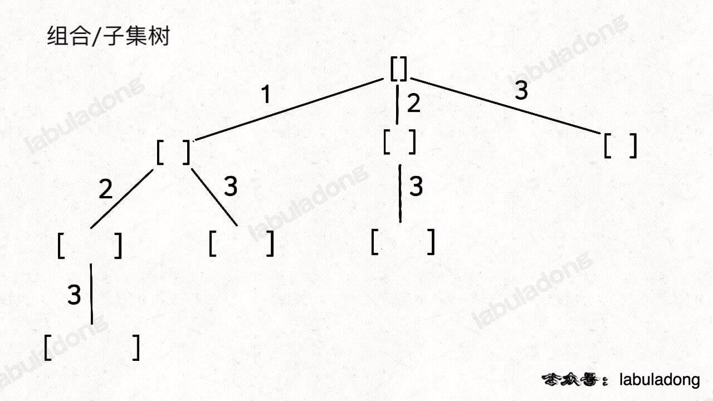
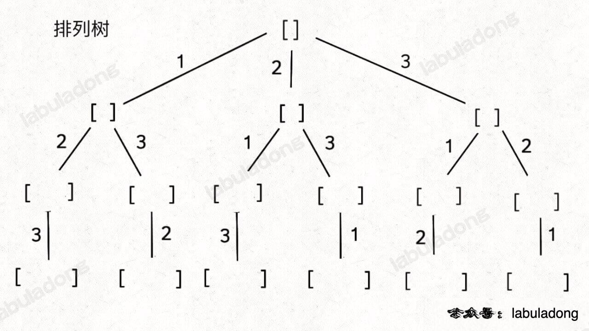

回溯算法秒杀所有排列/组合/子集问题
======
> https://labuladong.github.io/algo/1/8/


读完本文，你不仅学会了**算法套路**，还可以顺便解决如下题目：

[78. 子集](https://leetcode.cn/problems/subsets/)

[90. 子集 II](https://leetcode.cn/problems/subsets-ii/)

[77. 组合](https://leetcode.cn/problems/combinations/)

[39. 组合总和](https://leetcode.cn/problems/combination-sum/)

[40. 组合总和 II](https://leetcode.cn/problems/combination-sum-ii/)

[216. 组合总和 III](https://leetcode.cn/problems/combination-sum-iii/)

[46. 全排列](https://leetcode.cn/problems/permutations/)

[47. 全排列 II](https://leetcode.cn/problems/permutations-ii/)

**----------**

虽然**排列、组合、子集系列问题**是高中就学过的，
但如果想编写算法解决它们，还是非常考验计算机思维的，
**本文就讲讲编程解决这几个问题的核心思路，以后再有什么变体，你也能手到擒来，以不变应万变。**

无论是排列、组合还是子集问题，简单说无非就是让你从序列 `nums` 中以给定规则取若干元素，主要有以下几种变体：

**形式一、元素无重不可复选，即 `nums` 中的元素都是唯一的，每个元素最多只能被使用一次，这也是最基本的形式**。

以组合为例，如果输入 `nums = [2,3,6,7]`，和为 7 的组合应该只有 `[7]`。

**形式二、元素可重不可复选，即 `nums` 中的元素可以存在重复，每个元素最多只能被使用一次**。

以组合为例，如果输入 `nums = [2,5,2,1,2]`，和为 7 的组合应该有两种 `[2,2,2,1]` 和 `[5,2]`。

**形式三、元素无重可复选，即 `nums` 中的元素都是唯一的，每个元素可以被使用若干次**。

以组合为例，如果输入 `nums = [2,3,6,7]`，和为 7 的组合应该有两种 `[2,2,3]` 和 `[7]`。

当然，也可以说有第四种形式，即元素可重可复选。但既然元素可复选，那又何必存在重复元素呢？
元素去重之后就等同于形式三，所以这种情况不用考虑。

上面用组合问题举的例子，但排列、组合、子集问题都可以有这三种基本形式，所以共有 9 种变化。

除此之外，题目也可以再添加各种限制条件，比如让你求和为 `target` 且元素个数为 `k` 的组合，
那这么一来又可以衍生出一堆变体，怪不得面试笔试中经常考到排列组合这种基本题型。

**但无论形式怎么变化，其本质就是穷举所有解，而这些解呈现树形结构，
所以合理使用回溯算法框架，稍改代码框架即可把这些问题一网打尽**。

具体来说，你需要先阅读并理解前文 [回溯算法核心套路](https://labuladong.github.io/algo/4/29/103/) ，
然后**记住如下子集问题和排列问题的回溯树，就可以解决所有排列组合子集相关的问题**：





**为什么只要记住这两种树形结构就能解决所有相关问题呢？**

**首先，组合问题和子集问题其实是等价的，这个后面会讲；
至于之前说的三种变化形式，无非是在这两棵树上剪掉或者增加一些树枝罢了**。

那么，接下来我们就开始穷举，把排列/组合/子集问题的 9 种形式都过一遍，
学学**如何用回溯算法把它们一套带走。**


# 子集（元素无重不可复选）

力扣第 78 题「子集」就是这个问题：

题目给你输入一个无重复元素的数组 `nums`，其中每个元素最多使用一次，请你返回 `nums` 的所有子集。

函数签名如下：

```java
List<List<Integer>> subsets(int[] nums)
```

比如输入 `nums = [1,2,3]`，算法应该返回如下子集：

```java
[ [],[1],[2],[3],[1,2],[1,3],[2,3],[1,2,3] ]
```

好，我们暂时不考虑如何用代码实现，先回忆一下我们的高中知识，**如何手推所有子集？**

首先，生成元素个数为 0 的子集，即空集 `[]`，为了方便表示，我称之为 `S_0`。

然后，在 `S_0` 的基础上生成元素个数为 1 的所有子集，我称为 `S_1`：


接下来，我们可以在 `S_1` 的基础上推导出 `S_2`，即元素个数为 2 的所有子集：


为什么集合 `[2]` 只需要添加 `3`，而不添加前面的 `1` 呢？

因为集合中的元素不用考虑顺序， `[1,2,3]` 中 `2` 后面只有 `3`，
如果你向前考虑 `1`，那么 `[2,1]` 会和之前已经生成的子集 `[1,2]` 重复。

**换句话说，我们通过保证元素之间的相对顺序不变来防止出现重复的子集**。

接着，我们可以通过 `S_2` 推出 `S_3`，实际上 `S_3` 中只有一个集合 `[1,2,3]`，它是通过 `[1,2]` 推出的。

整个推导过程就是这样一棵树：


注意这棵树的特性：

**如果把根节点作为第 0 层，将每个节点和根节点之间树枝上的元素作为该节点的值，
那么第 `n` 层的所有节点就是大小为 `n` 的所有子集**。

你比如大小为 2 的子集就是这一层节点的值：


PS：**注意，本文之后所说「节点的值」都是指节点和根节点之间树枝上的元素，且将根节点认为是第 0 层**。

那么再进一步，**如果想计算所有子集，那只要遍历这棵多叉树，把所有节点的值收集起来不就行了？**

直接看代码：

```java
List<List<Integer>> res = new LinkedList<>();
// 记录回溯算法的递归路径
LinkedList<Integer> track = new LinkedList<>();

// 主函数
public List<List<Integer>> subsets(int[] nums) {
    backtrack(nums, 0);
    return res;
}

// 回溯算法核心函数，遍历子集问题的回溯树
void backtrack(int[] nums, int start) {

    // 前序位置，每个节点的值都是一个子集
    res.add(new LinkedList<>(track));
    
    // 回溯算法标准框架
    for (int i = start; i < nums.length; i++) {
        // 做选择
        track.addLast(nums[i]);
        // 通过 start 参数控制树枝的遍历，避免产生重复的子集
        backtrack(nums, i + 1);
        // 撤销选择
        track.removeLast();
    }
}
```

看过前文 [回溯算法核心框架](https://labuladong.github.io/algo/4/29/103/) 
的读者应该很容易理解这段代码吧，我们使用 `start` 参数控制树枝的生长避免产生重复的子集，
用 `track` 记录根节点到每个节点的路径的值，同时在前序位置把每个节点的路径值收集起来，
完成回溯树的遍历就收集了所有子集：


最后，`backtrack` 函数开头看似没有 base case，会不会进入无限递归？

其实不会的，当 `start == nums.length` 时，叶子节点的值会被装入 `res`，
但 for 循环不会执行，也就结束了递归。


# 组合（元素无重不可复选）

如果你能够成功的生成所有无重子集，那么你稍微改改代码就能生成所有无重组合了。

你比如说，让你在 `nums = [1,2,3]` 中拿 2 个元素形成所有的组合，你怎么做？

稍微想想就会发现，大小为 2 的所有组合，不就是所有大小为 2 的子集嘛。

**所以我说组合和子集是一样的：大小为 `k` 的组合就是大小为 `k` 的子集**。

比如力扣第 77 题「组合」：

给定两个整数 `n` 和 `k`，返回范围 `[1, n]` 中所有可能的 `k` 个数的组合。

函数签名如下：

```java
List<List<Integer>> combine(int n, int k)
```

比如 `combine(3, 2)` 的返回值应该是：

```
[ [1,2],[1,3],[2,3] ]
```

这是**标准的组合问题**，但我给你翻译一下就**变成子集问题**了：

**给你输入一个数组 `nums = [1,2..,n]` 和一个正整数 `k`，请你生成所有大小为 `k` 的子集**。

还是以 `nums = [1,2,3]` 为例，刚才让你求所有子集，就是把所有节点的值都收集起来；
**现在你只需要把第 2 层（根节点视为第 0 层）的节点收集起来，就是大小为 2 的所有组合**：


反映到代码上，只需要稍改 base case，控制算法仅仅收集第 `k` 层节点的值即可：

```java
List<List<Integer>> res = new LinkedList<>();
// 记录回溯算法的递归路径
LinkedList<Integer> track = new LinkedList<>();

// 主函数
public List<List<Integer>> combine(int n, int k) {
    backtrack(1, n, k);
    return res;
}

void backtrack(int start, int n, int k) {
    // base case
    if (k == track.size()) {
        // 遍历到了第 k 层，收集当前节点的值
        res.add(new LinkedList<>(track));
        return;
    }
    
    // 回溯算法标准框架
    for (int i = start; i <= n; i++) {
        // 选择
        track.addLast(i);
        // 通过 start 参数控制树枝的遍历，避免产生重复的子集
        backtrack(i + 1, n, k);
        // 撤销选择
        track.removeLast();
    }
}
```

这样，**标准的子集问题**也解决了。


# 排列（元素无重不可复选）

