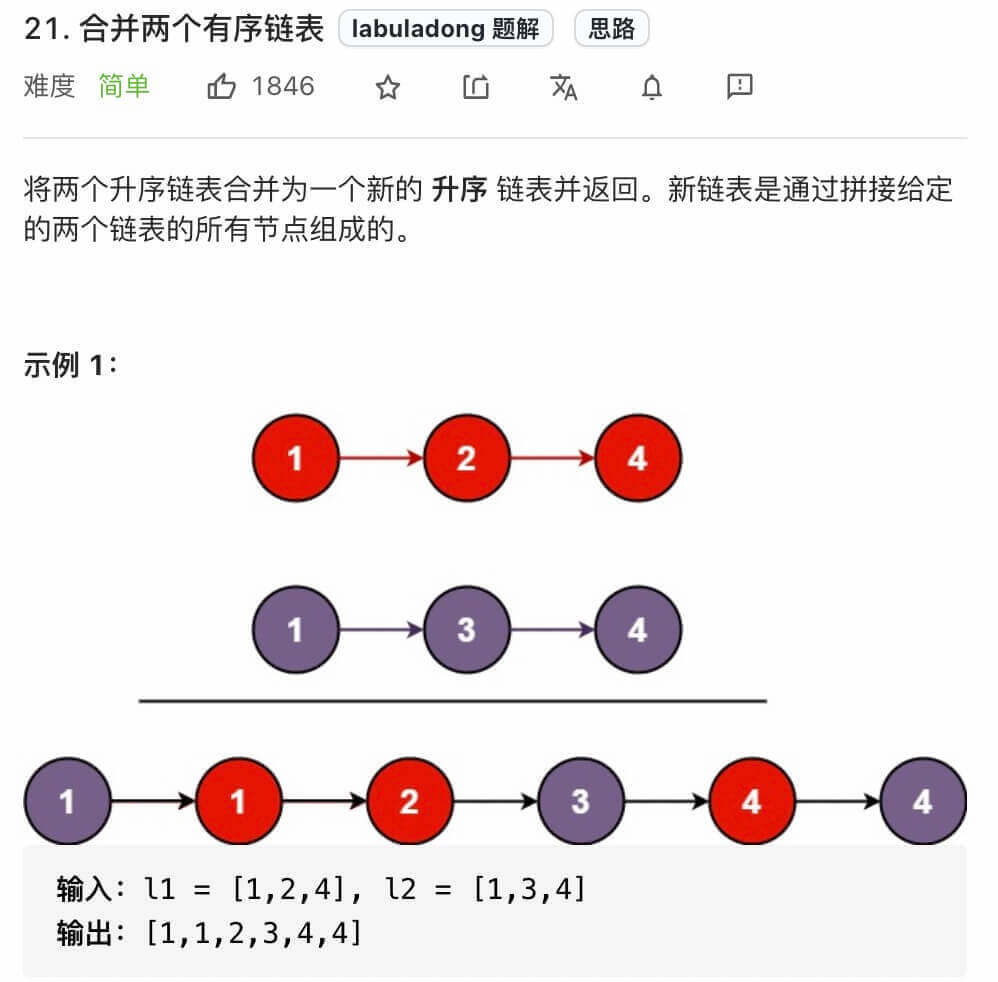
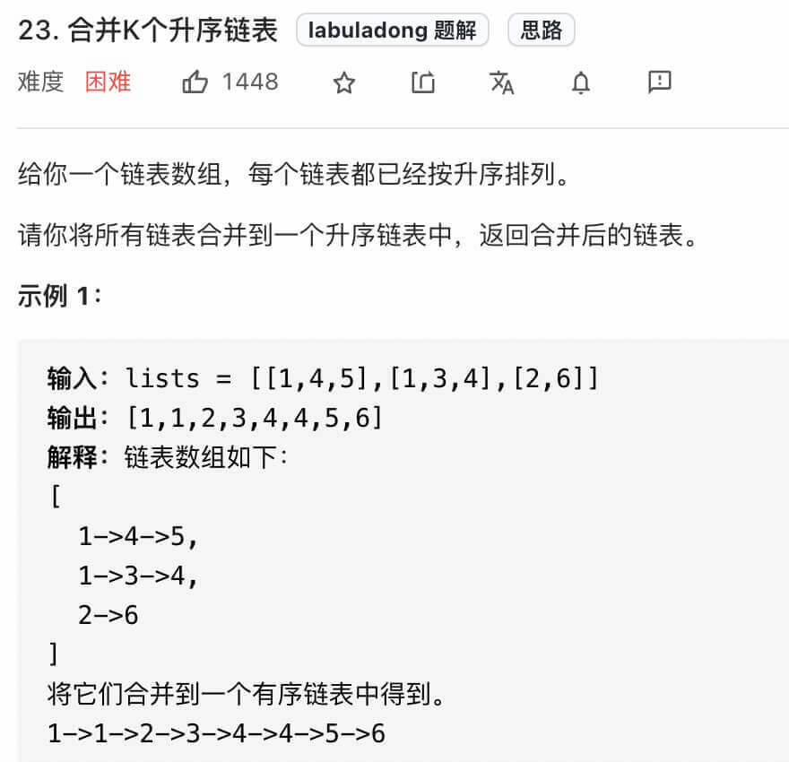
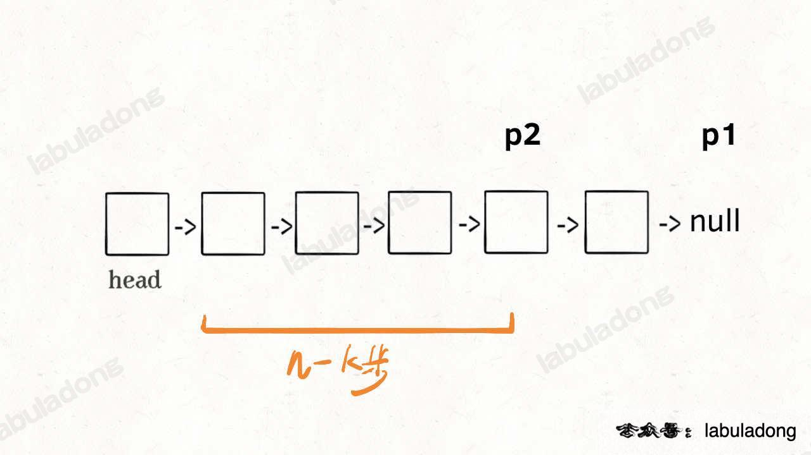
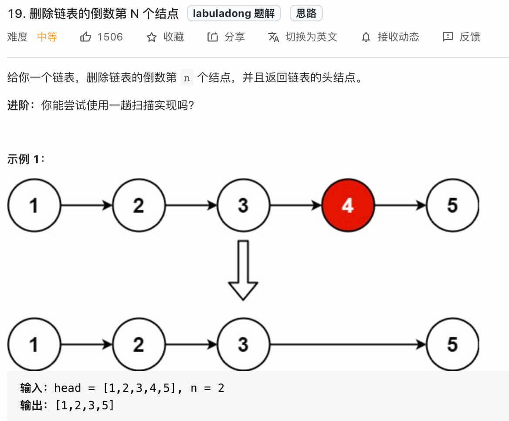

双指针技巧秒杀七道链表题目
======
> https://labuladong.github.io/algo/1/9/


读完本文，你不仅学会了**算法套路**，还可以顺便解决如下题目：

[19. 删除链表的倒数第 N 个结点](https://leetcode.cn/problems/remove-nth-node-from-end-of-list/)

[21. 合并两个有序链表](https://leetcode.cn/problems/merge-two-sorted-lists/)

[23. 合并K个升序链表](https://leetcode.cn/problems/merge-k-sorted-lists/)

[141. 环形链表](https://leetcode.cn/problems/linked-list-cycle/)

[142. 环形链表 II](https://leetcode.cn/problems/linked-list-cycle-ii/)

[160. 相交链表](https://leetcode.cn/problems/intersection-of-two-linked-lists/)

[876. 链表的中间结点](https://leetcode.cn/problems/middle-of-the-linked-list/)

**-----------**

上次在视频号直播，跟大家说到单链表有很多巧妙的操作，
本文就总结一下**单链表的基本技巧，每个技巧都对应着至少一道算法题**：

1、合并两个有序链表

2、合并 `k` 个有序链表

3、寻找单链表的倒数第 `k` 个节点

4、寻找单链表的中点

5、判断单链表是否包含环并找出环起点

6、判断两个单链表是否相交并找出交点

这些解法都用到了**双指针技巧**，所以说对于单链表相关的题目，双指针的运用是非常广泛的，
下面我们就来一个一个看。


# 合并两个有序链表

这是最基本的链表技巧，力扣第 21 题「合并两个有序链表」就是这个问题：



给你输入两个有序链表，请你把他俩合并成一个新的有序链表，
函数签名如下：

```java
ListNode mergeTwoLists(ListNode l1, ListNode l2);
```

这题比较简单，我们直接看解法：

```java
ListNode mergeTwoLists(ListNode l1, ListNode l2) {
    // 虚拟头结点
    ListNode dummy = new ListNode(-1), p = dummy;
    ListNode p1 = l1, p2 = l2;
    
    while (p1 != null && p2 != null) {
        // 比较 p1 和 p2 两个指针
        // 将值较小的的节点接到 p 指针
        if (p1.val > p2.val) {
            p.next = p2;
            p2 = p2.next;
        } else {
            p.next = p1;
            p1 = p1.next;
        }
        // p 指针不断前进
        p = p.next;
    }
    
    if (p1 != null) {
        p.next = p1;
    }
    
    if (p2 != null) {
        p.next = p2;
    }
    
    return dummy.next;
}
```

我们的 while 循环每次比较 `p1` 和 `p2` 的大小，把较小的节点接到结果链表上，
看如下 GIF：


这个算法的逻辑类似于「拉拉链」，`l1, l2` 类似于拉链两侧的锯齿，
指针 `p` 就好像拉链的拉索，将两个有序链表合并。

**代码中还用到一个链表的算法题中是很常见的「虚拟头结点」技巧，也就是 `dummy` 节点**。
你可以试试，如果不使用 `dummy` 虚拟节点，代码会复杂很多，
而有了 `dummy` 节点这个占位符，可以避免处理空指针的情况，降低代码的复杂性。


# 合并 k 个有序链表

看下力扣第 23 题「合并K个升序链表」：



函数签名如下：

```java
ListNode mergeKLists(ListNode[] lists);
```

合并 `k` 个有序链表的逻辑类似合并两个有序链表，
**难点在于，如何快速得到 `k` 个节点中的最小节点，接到结果链表上？**

这里我们就要用到 [优先级队列（二叉堆）](https://labuladong.github.io/algo/2/21/62/) 
这种数据结构，把链表节点放入一个最小堆，就可以每次获得 `k` 个节点中的最小节点：

```java
ListNode mergeKLists(ListNode[] lists) {
    if (lists.length == 0) return null;
    // 虚拟头结点
    ListNode dummy = new ListNode(-1);
    ListNode p = dummy;
    // 优先级队列，最小堆
    PriorityQueue<ListNode> pq = new PriorityQueue<>(
        lists.length, (a, b)->(a.val - b.val));
    // 将 k 个链表的头结点加入最小堆
    for (ListNode head : lists) {
        if (head != null)
            pq.add(head);
    }

    while (!pq.isEmpty()) {
        // 获取最小节点，接到结果链表中
        ListNode node = pq.poll();
        p.next = node;
        if (node.next != null) {
            pq.add(node.next);
        }
        // p 指针不断前进
        p = p.next;
    }
    return dummy.next;
}
```

这个算法是面试常考题，它的时间复杂度是多少呢？

优先队列 `pq` 中的元素个数最多是 `k`，
所以一次 `poll` 或者 `add` 方法的时间复杂度是 `O(logk)`；
所有的链表节点都会被加入和弹出 `pq`，
**所以算法整体的时间复杂度是 `O(Nlogk)`，其中 `k` 是链表的条数，`N` 是这些链表的节点总数**。


# 单链表的倒数第 k 个节点

从前往后寻找单链表的第 `k` 个节点很简单，一个 for 循环遍历过去就找到了，
但是**如何寻找从后往前数的第 k 个节点呢？**

那你可能说，假设链表有 `n` 个节点，倒数第 `k` 个节点就是正数第 `n - k + 1` 个节点，
不也是一个 for 循环的事儿吗？

是的，但是算法题一般只给你一个 `ListNode` 头结点代表一条单链表，
你不能直接得出这条链表的长度 `n`，而需要先遍历一遍链表算出 `n` 的值，
然后再遍历链表计算第 `n - k + 1` 个节点。

也就是说，这个解法需要遍历两次链表才能得到出倒数第 `k` 个节点。

那么，我们能不能**只遍历一次链表**，就算出倒数第 `k` 个节点？
可以做到的，如果是面试问到这道题，面试官肯定也是希望你给出只需遍历一次链表的解法。

这个解法就比较巧妙了，假设 `k = 2`，思路如下：

首先，我们先让一个指针 `p1` 指向链表的头节点 `head`，然后走 `k` 步：


现在的 `p1`，只要再走 `n - k` 步，就能走到链表末尾的空指针了对吧？

趁这个时候，再用一个指针 `p2` 指向链表头节点 `head`：


接下来就很显然了，让 `p1` 和 `p2` 同时向前走，
`p1` 走到链表末尾的空指针时前进了 `n - k` 步，`p2` 也从 `head` 开始前进了 `n - k` 步，
停留在第 `n - k + 1` 个节点上，即恰好停链表的倒数第 `k` 个节点上：



这样，只遍历了一次链表，就获得了倒数第 `k` 个节点 `p2`。

上述逻辑的代码如下：

```java
// 返回链表的倒数第 k 个节点
ListNode findFromEnd(ListNode head, int k) {
    ListNode p1 = head;
    // p1 先走 k 步
    for (int i = 0; i < k; i++) {
        p1 = p1.next;
    }
    ListNode p2 = head;
    // p1 和 p2 同时走 n - k 步
    while (p1 != null) {
        p2 = p2.next;
        p1 = p1.next;
    }
    // p2 现在指向第 n - k 个节点
    return p2;
}
```

当然，如果用 big O 表示法来计算时间复杂度，
无论遍历一次链表和遍历两次链表的时间复杂度都是 `O(N)`，但上述这个算法更有技巧性。

很多链表相关的算法题都会用到这个技巧，
比如说力扣第 19 题「删除链表的倒数第 N 个结点」：



我们直接看解法代码：

```java
// 主函数
public ListNode removeNthFromEnd(ListNode head, int n) {
    // 虚拟头结点
    ListNode dummy = new ListNode(-1);
    dummy.next = head;
    // 删除倒数第 n 个，要先找倒数第 n + 1 个节点
    ListNode x = findFromEnd(dummy, n + 1);
    // 删掉倒数第 n 个节点
    x.next = x.next.next;
    return dummy.next;
}
    
private ListNode findFromEnd(ListNode head, int k) {
    // 代码见上文
}
```

这个逻辑就很简单了，要删除倒数第 `n` 个节点，就得获得倒数第 `n + 1` 个节点的引用，
可以用我们实现的 `findFromEnd` 来操作。

不过注意我们又使用了**虚拟头结点**的技巧，也是为了防止出现空指针的情况，
比如说链表总共有 5 个节点，题目就让你删除倒数第 5 个节点，也就是第一个节点，
那按照算法逻辑，应该首先找到倒数第 6 个节点。
但第一个节点前面已经没有节点了，这就会出错。

但有了我们虚拟节点 `dummy` 的存在，就避免了这个问题，能够对这种情况进行正确的删除。


# 单链表的中点

力扣第 876 题「链表的中间结点」就是这个题目，
**问题的关键也在于我们无法直接得到单链表的长度 `n`，**
常规方法也是先遍历链表计算 `n`，再遍历一次得到第 `n / 2` 个节点，也就是中间节点。

如果想一次遍历就得到中间节点，也需要耍点小聪明，使用「**快慢指针**」的技巧：

我们让两个指针 `slow` 和 `fast` 分别指向链表头结点 `head`。

**每当慢指针 `slow` 前进一步，快指针 `fast` 就前进两步，
这样，当 `fast` 走到链表末尾时，`slow` 就指向了链表中点**。

上述思路的代码实现如下：

```java
ListNode middleNode(ListNode head) {
    // 快慢指针初始化指向 head
    ListNode slow = head, fast = head;
    // 快指针走到末尾时停止
    while (fast != null && fast.next != null) {
        // 慢指针走一步，快指针走两步
        slow = slow.next;
        fast = fast.next.next;
    }
    // 慢指针指向中点
    return slow;
}
```

需要注意的是，**如果链表长度为偶数，也就是说中点有两个的时候，
我们这个解法返回的节点是靠后的那个节点。**

另外，这段代码稍加修改就可以直接用到判断链表成环的算法题上。


# 判断链表是否包含环
> [141. 环形链表](https://leetcode.cn/problems/linked-list-cycle/)

**判断链表是否包含环属于经典问题了，解决方案也是用快慢指针**：

每当慢指针 `slow` 前进一步，快指针 `fast` 就前进两步。

如果 `fast` 最终遇到空指针，说明链表中没有环；
如果 `fast` 最终和 `slow` 相遇，那肯定是 `fast` 超过了 `slow` 一圈，说明链表中含有环。

只需要把寻找链表中点的代码稍加修改就行了：

```java
boolean hasCycle(ListNode head) {
    // 快慢指针初始化指向 head
    ListNode slow = head, fast = head;
    // 快指针走到末尾时停止
    while (fast != null && fast.next != null) {
        // 慢指针走一步，快指针走两步
        slow = slow.next;
        fast = fast.next.next;
        // 快慢指针相遇，说明含有环
        if (slow == fast) {
            return true;
        }
    }
    // 不包含环
    return false;
}
```

当然，这个问题还有进阶版：
**如果链表中含有环，如何计算这个环的起点？**

> [142. 环形链表 II](https://leetcode.cn/problems/linked-list-cycle-ii/)

这里简单提一下解法：

```java
ListNode detectCycle(ListNode head) {
    ListNode fast, slow;
    fast = slow = head;
    while (fast != null && fast.next != null) {
        fast = fast.next.next;
        slow = slow.next;
        if (fast == slow) break;
    }
    // 上面的代码类似 hasCycle 函数
    if (fast == null || fast.next == null) {
        // fast 遇到空指针说明没有环
        return null;
    }

    // 重新指向头结点
    slow = head;
    // 快慢指针同步前进，相交点就是环起点
    while (slow != fast) {
        fast = fast.next;
        slow = slow.next;
    }
    return slow;
}
```


