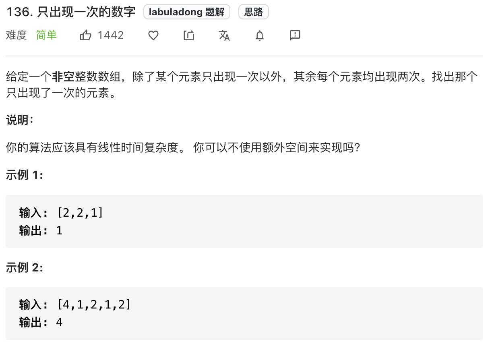

常用的位操作
======


<p align='center'>
<a href="https://github.com/labuladong/fucking-algorithm" target="view_window"></a>
<a href="https://www.zhihu.com/people/labuladong"></a>
<a href="https://i.loli.net/2020/10/10/MhRTyUKfXZOlQYN.jpg"></a>
<a href="https://space.bilibili.com/14089380"></a>
</p>


**《labuladong 的算法秘籍》、《labuladong 的刷题笔记》两本 PDF 和刷题插件 2.0 免费开放下载，详情见 [labuladong 的刷题三件套正式发布](https://mp.weixin.qq.com/s/yN4cHQRsFa5SWlacopHXYQ)**~

读完本文，你不仅学会了算法套路，还可以顺便去 LeetCode 上拿下如下题目：

[191.位1的个数](https://leetcode-cn.com/problems/number-of-1-bits)

[231.2的幂](https://leetcode-cn.com/problems/power-of-two/)

**-----------**

本文分两部分，第一部分列举几个有趣的位操作，第二部分讲解算法题中常用的位运算操作。
因为位操作很简单，所以假设读者已经了解与、或、异或这三种基本操作。

位操作（Bit Manipulation）可以玩出很多奇技淫巧，但是这些技巧大部分都过于晦涩，没必要深究，读者只要记住一些有用的操作即可。


### 一、几个有趣的位操作

1. **利用或操作 `|` 和空格将英文字符转换为小写**

```c
('a' | ' ') = 'a'
('A' | ' ') = 'a'
```

2. **利用与操作 `&` 和下划线将英文字符转换为大写**

```c
('b' & '_') = 'B'
('B' & '_') = 'B'
```

3. **利用异或操作 `^` 和空格进行英文字符大小写互换**

```c
('d' ^ ' ') = 'D'
('D' ^ ' ') = 'd'
```

以上操作能够产生奇特效果的原因在于 ASCII 编码。
字符其实就是数字，恰巧这些字符对应的数字通过位运算就能得到正确的结果。
有兴趣的读者可以查 ASCII 码表自己算算，本文就不展开讲了。

4. **判断两个数是否异号**

```cpp
int x = -1, y = 2;
bool f = ((x ^ y) < 0); // true

int x = 3, y = 2;
bool f = ((x ^ y) < 0); // false
```

这个技巧还是很实用的，利用的是**补码编码的符号位**。
如果不用位运算来判断是否异号，需要使用 if else 分支，还挺麻烦的。
读者可能想利用乘积或者商来判断两个数是否异号，但是这种处理方式可能造成溢出，从而出现错误。


### 二、`n & (n-1)` 的运用

`n & (n-1)` 这个操作是算法中常见的，作用是消除数字 `n` 的二进制表示中的最后一个 1。

看个图就很容易理解了：


其核心逻辑就是，`n - 1` 一定可以消除最后一个 1，同时把其后的 0 都变成 1，
这样再和 `n` 做一次 `&` 运算，就可以仅仅把最后一个 1 变成 0 了。

**1、计算汉明权重（Hamming Weight）**


就是让你返回 n 的二进制表示中有几个 1。
因为 `n & (n - 1)` 可以消除最后一个 1，所以可以用一个循环不停地消除 1 同时计数，直到 n 变成 0 为止。

```cgo
int hammingWeight(int n) {
    int res = 0;
    while (n != 0) {
        n = n & (n - 1);
        res++;
    }
    return res;
}
```

**2、判断一个数是不是 2 的指数**

一个数如果是 2 的指数，那么它的二进制表示一定只含有一个 1：

```cgo
2^0 = 1 = 0b0001
2^1 = 2 = 0b0010
2^2 = 4 = 0b0100
```

如果使用  `n & (n-1)` 的技巧就很简单了（注意运算符优先级，括号不可以省略）：

```cgo
bool isPowerOfTwo(int n) {
    if (n <= 0) {
        return false;
    }
    return (n & (n - 1)) == 0;
}
```


### 三、`a ^ a = 0` 的运用
**异或运算的性质**是需要我们牢记的：
**一个数和它本身做异或运算结果为 0，即 `a ^ a = 0`；一个数和 0 做异或运算的结果为它本身，即 `a ^ 0 = a`。**

**1、查找只出现一次的元素**

这是力扣第 136 题「 只出现一次的数字」：



对于这道题目，我们只要把所有数字进行异或，成对儿的数字就会变成 0，落单的数字和 0 做异或还是它本身，
所以最后异或的结果就是只出现一次的元素：

```cgo
int singleNumber(int[] nums) {
    int res = 0;
    for (int n : nums) {
        res ^= n;
    }
    return res;
}
```

**2、寻找缺失的元素**

这是力扣第 268 题「 丢失的数字」：

给一个长度为 n 的数组，其索引应该在 [0,n)，但是现在你要装进去 n + 1 个元素 [0,n]，那么肯定有一个元素装不下嘛，请你找出这个缺失的元素。
这道题不难的，我们应该很容易想到，把这个数组排个序，然后遍历一遍，不就很容易找到缺失的那个元素了吗？
或者说，借助数据结构的特性，用一个 HashSet 把数组里出现的数字都储存下来，再遍历 [0,n] 之间的数字，
去 HashSet 中查询，也可以很容易查出那个缺失的元素。
排序解法的时间复杂度是 O(NlogN)，HashSet 的解法时间复杂度是 O(N)，但是还需要 O(N) 的空间复杂度存储 HashSet。

这个问题其实还有一个特别简单的解法：等差数列求和公式。
题目的意思可以这样理解：现在有个等差数列 0, 1, 2,..., n，其中少了某一个数字，请你把它找出来。
那这个数字不就是 sum(0,1,..n) - sum(nums) 嘛？
```cgo
int missingNumber(int[] nums) {
    int n = nums.length;
    // 虽然题目给的数据范围不大，但严谨起见，用 long 类型防止整型溢出
    // 求和公式：(首项 + 末项) * 项数 / 2
    long expect = (0 + n) * (n + 1) / 2;
    long sum = 0;
    for (int x : nums) {
        sum += x;
    }
    return (int)(expect - sum);
}
```

不过，本文的主题是位运算，我们来讲讲如何利用位运算技巧来解决这道题。
再回顾一下异或运算的性质：一个数和它本身做异或运算结果为 0，一个数和 0 做异或运算还是它本身。
而且异或运算满足交换律和结合律，也就是说：
```cgo
2 ^ 3 ^ 2 = 3 ^ (2 ^ 2) = 3 ^ 0 = 3
```
而这道题就可以通过这些性质巧妙算出缺失的那个元素，比如说 nums = [0,3,1,4]：

为了容易理解，我们假设先把索引补一位，然后让每个元素和自己相等的索引相对应：

这样做了之后，就可以发现除了缺失元素之外，所有的索引和元素都组成一对儿了，现在如果把这个落单的索引 2 找出来，也就找到了缺失的那个元素。
如何找这个落单的数字呢，只要把所有的元素和索引做异或运算，成对儿的数字都会消为 0，只有这个落单的元素会剩下，也就达到了我们的目的：
```cgo
int missingNumber(int[] nums) {
    int n = nums.length;
    int res = 0;
    // 先和新补的索引异或一下
    res ^= n;
    // 和其他的元素、索引做异或
    for (int i = 0; i < n; i++)
        res ^= i ^ nums[i];
    return res;
}
```
由于异或运算满足交换律和结合律，所以总是能把成对儿的数字消去，留下缺失的那个元素。

以上便是一些有趣/常用的位操作。其实位操作的技巧很多，
有一个叫做 Bit Twiddling Hacks 的外国网站收集了几乎所有位操作的黑科技玩法，感兴趣的读者可以查看：

http://graphics.stanford.edu/~seander/bithacks.html#ReverseParallel

**＿＿＿＿＿＿＿＿＿＿＿＿＿**

**刷算法，学套路，认准 labuladong，公众号和 [在线电子书](https://labuladong.gitee.io/algo/) 持续更新最新文章**。

**本小抄即将出版，微信扫码关注公众号，后台回复「小抄」限时免费获取，回复「进群」可进刷题群一起刷题，带你搞定 LeetCode**。

<p align='center'>

</p>
======其他语言代码======

[191.位1的个数](https://leetcode-cn.com/problems/number-of-1-bits)

[231.2的幂](https://leetcode-cn.com/problems/power-of-two/)

